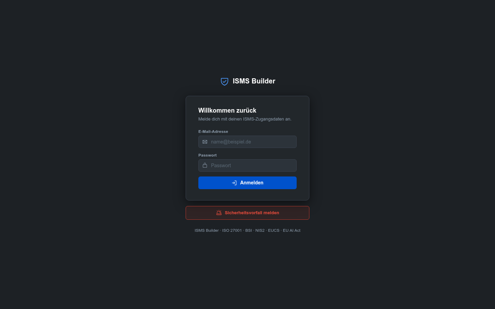
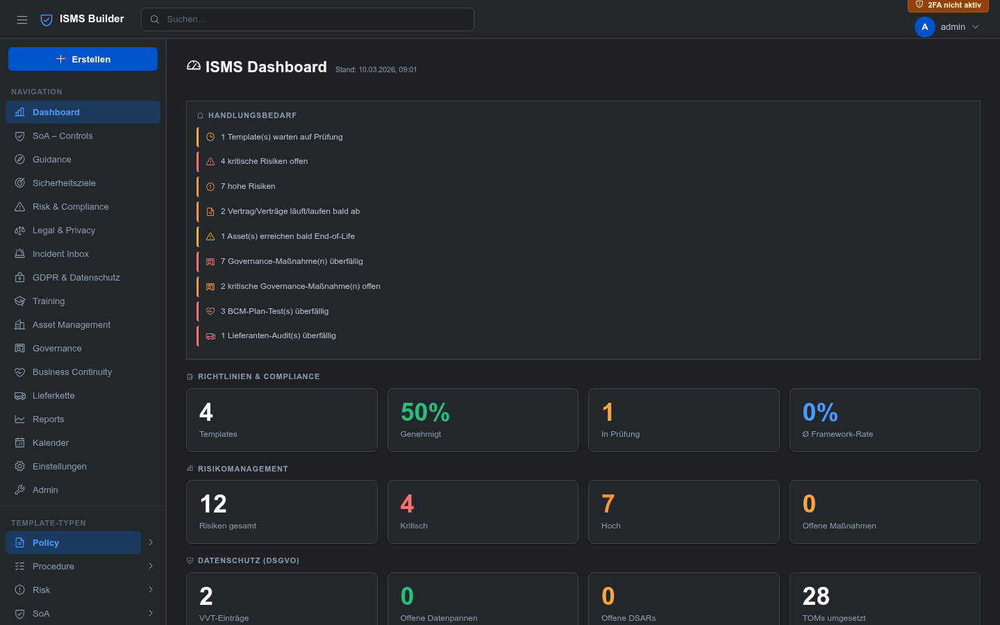
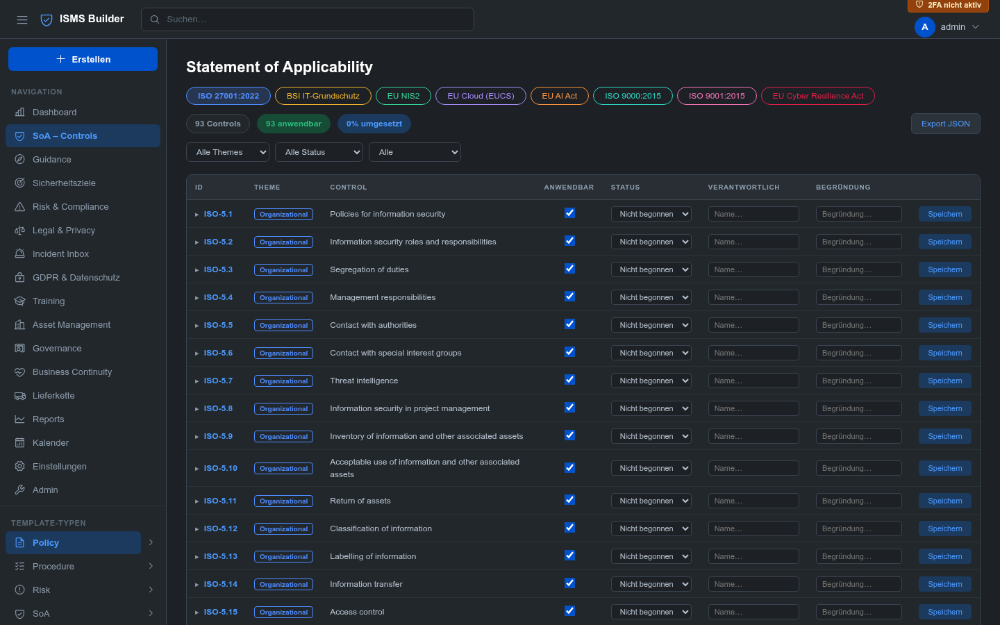
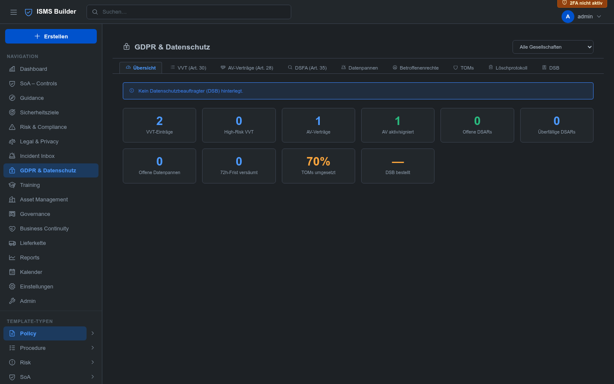
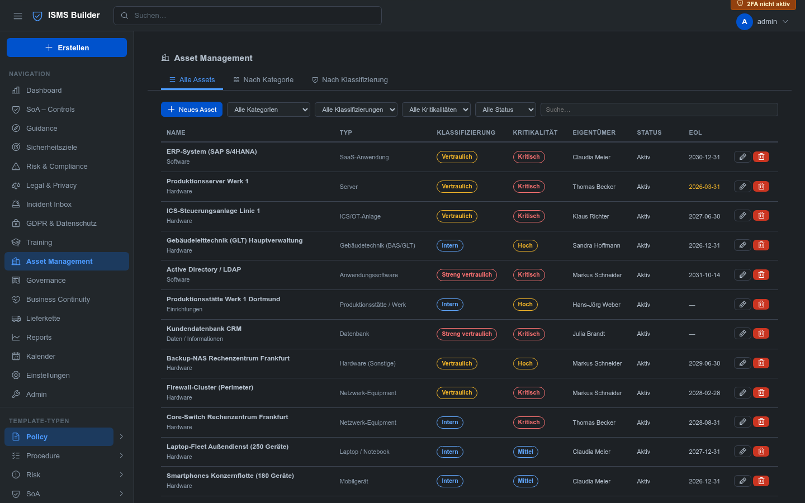
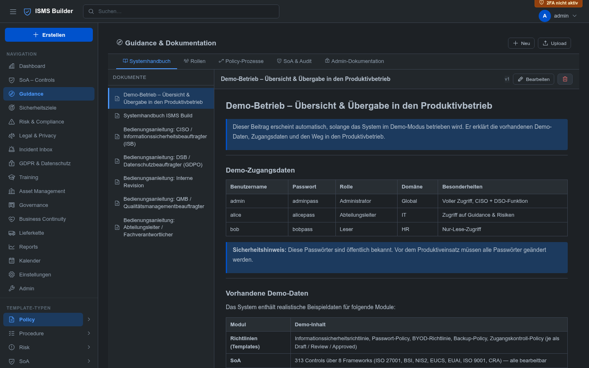
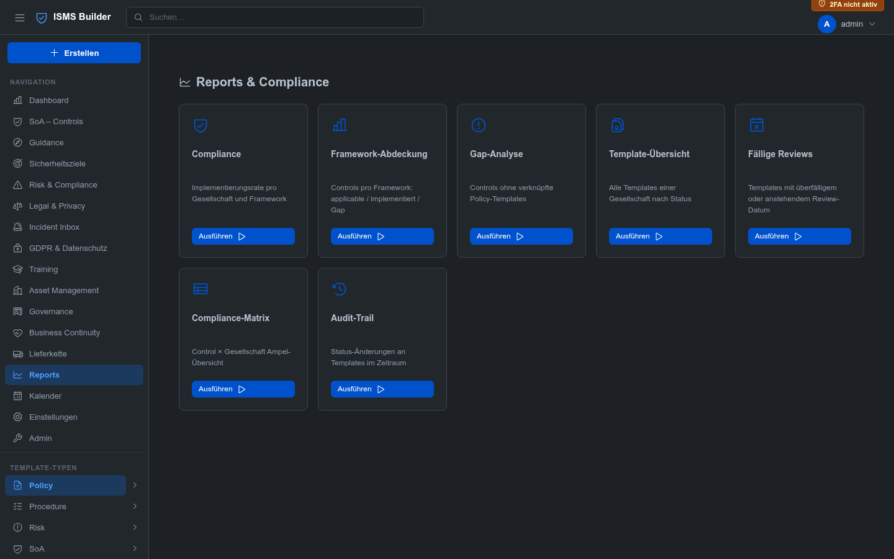

<!-- © 2026 Claude Hecker — ISMS Builder V 1.32.0 — AGPL-3.0 -->

# ISMS Builder

**Self-hosted Information Security Management System — open source, no cloud required**

[](https://github.com/coolstartnow/isms-builder/actions/workflows/ci.yml)
[](https://github.com/coolstartnow/isms-builder/actions)
[](LICENSE)
[](https://nodejs.org)
[](CHANGELOG.md)

<!-- GDPR NOTE: The four badges above (CI, Tests, License, Node.js) load resources
     from external servers (github.com, shields.io/Cloudflare, img.shields.io).
     When this README is rendered in a browser, these requests transmit the viewer's
     IP address to third parties (incl. US-based servers — GDPR Art. 44 ff.).
     For 100% GDPR-compliant self-hosted documentation, replace these four badge
     lines with their local equivalents from docs/badges/ or remove them entirely. -->

---

> ## ⚠️ Security Warning: Fake repositories and copies distributing malware
> ISMS Builder has **no packaged "releases", installers, or downloadable ZIP files** — the only
> legitimate source is this repository, cloned or downloaded directly from GitHub as plain
> source code. We are aware of at least one **malicious repository impersonating this project**
> (fake README, fake "Download" button linking to a ZIP disguised as a screenshot, containing a
> Windows malware loader — `.cmd` → `.exe` → Lua-DLL payload chain). **Do not download or run any
> "isms_builder" ZIP/installer/exe from anywhere other than this repository.**
> If you find a suspicious repo or site impersonating this project, please open an
> [issue](https://github.com/coolstartnow/isms-builder/issues) or a
> [discussion](https://github.com/coolstartnow/isms-builder/discussions) so we can flag it.

---

> **Status: Active development — not yet a finished product.**
> The core modules are functional and in use, but some features are incomplete
> and the platform is still growing. Contributions, feedback and real-world
> testing are very welcome — that is exactly why this was open-sourced.

---

## What is ISMS Builder?

ISMS Builder is a **self-hosted web platform** for managing an Information Security Management System (ISMS).
It covers the full compliance lifecycle — from policy authoring to audit evidence — for ISO 27001:2022, NIS2, GDPR/DSGVO, BSI IT-Grundschutz and other frameworks.

**No cloud. No SaaS fees. Your data stays on your server.**

> Designed for SMEs, IT teams, and consultants who need a real ISMS tool without a five-figure vendor contract.

---

## Screenshots

| Login | Dashboard |
|---|---|
|  |  |

| Statement of Applicability | Risk Management |
|---|---|
|  |  |

| GDPR & Datenschutz | Asset Management |
|---|---|
|  |  |

| Guidance & Dokumentation | Reports |
|---|---|
|  |  |

> Run `npm start` and open `https://localhost:3000` to explore the full demo dataset locally.

---

## Feature Overview

| Module | Description | Standards |
|---|---|---|
| **Policy Management** | Template CRUD, versioning, lifecycle (draft → review → approved → archived), space hierarchy, attachments | ISO 27001 §5 |
| **Statement of Applicability** | 313 controls across 8 frameworks, inline editing, gap analysis, cross-mapping | ISO 27001 A / BSI / NIS2 / EUCS / EUAI / ISO 9001 / CRA |
| **Risk Management** | Risk register, treatment plans, auditor role | ISO 27001 §6.1 |
| **Security Goals** | KPI tracking with progress bars, calendar integration | ISO 27001 §6.2 |
| **GDPR & Privacy** | VVT, AV-contracts, DSFA, TOMs, DSAR queue, 72h-timer, deletion log with email alerts | DSGVO Art. 13–35 |
| **Asset Management** | Asset register, classification levels, EoL tracking | ISO 27001 A.5.9–5.12 |
| **BCM / BCP** | Business Impact Analysis, continuity plans, exercises | ISO 27001 A.5.29–5.30 / NIS2 |
| **Training Records** | Training catalogue, completion tracking, certificate upload | ISO 27001 A.6.3 |
| **Supplier Management** | Vendor register, audit scheduling, risk assessment | ISO 27001 A.5.19–5.22 |
| **Legal & Contracts** | Contracts, NDAs, privacy policies, expiry calendar | |
| **Incident Inbox** | CISO inbox + **public reporting form** (no login required) | NIS2 / BSI |
| **Governance** | Management reviews, action tracking | ISO 27001 §9.3 |
| **Reports** | Compliance matrix (Control × Entity), gap report, review cycles, CSV export | |
| **Audit Findings** | Finding register (IST→SOLL→Risk→Recommendation), action plans, severity/status tracking, FIND-YYYY-NNNN ref | ISO 27001 §9.2 |
| **Traceability** | Every record links to SoA controls + policy documents — bidirectional | |
| **Semantic Search** | Local AI search via Ollama (nomic-embed-text) with keyword fallback | |
| **Multi-Entity** | Corporate structure tree, per-entity applicability for controls and policies | |
| **Multilingual UI & Demo Data** | Full UI and demo content in 🇩🇪 DE / 🇬🇧 EN / 🇫🇷 FR / 🇳🇱 NL; admin controls available languages | |

---

### ⚠ IMPORTANT: ISO Controls Require Manual Installation by the Administrator

> **ISO 27001:2022, ISO 9000:2015, and ISO 9001:2015** are copyright-protected standards published
> by the International Organization for Standardization (ISO, © ISO). The control definitions
> (titles, descriptions, requirement text) are **not included** in this software and must **not**
> be redistributed without a valid ISO licence.

**What this means in practice:**
The SoA modules for ISO 27001, ISO 9000, and ISO 9001 ship without control content.
The administrator **must manually import** the controls before these frameworks are usable:

1. Obtain a licensed copy of the standard from [iso.org](https://www.iso.org/) or an authorised national body
2. Prepare a JSON file with your control definitions (format documented in `scripts/import-iso-controls.sh`)
3. Run the import script:
   ```bash
   bash scripts/import-iso-controls.sh path/to/iso-controls.json
   ```
4. Restart the ISMS Builder server

> **Frameworks included out-of-the-box (no ISO licence required):**
> BSI IT-Grundschutz, EU NIS2, EUCS, EU AI Act, and CRA are based on publicly available
> EU legislation and German federal publications and are fully pre-installed.

Operating the ISO framework modules without a valid licence for the respective standard is the
sole responsibility of the operator. The ISMS Builder project and its contributors accept no
liability for unlicensed use of ISO-protected content.

---

## Quick Start

```bash
git clone https://github.com/coolstartnow/isms-builder.git
cd isms-builder
npm install
cp .env.example .env          # set JWT_SECRET to a long random string
npm start                     # http://localhost:3000
```

Login with **`admin@example.com` / `adminpass`**. On first login you will be prompted to choose your **demo data language** (🇩🇪 DE / 🇬🇧 EN / 🇫🇷 FR / 🇳🇱 NL) or start with an empty system. Change the admin password immediately after.

For production use with HTTPS:

```bash
# .env
JWT_SECRET=your-very-long-random-secret
STORAGE_BACKEND=json
SSL_CERT_FILE=/etc/ssl/certs/your.crt
SSL_KEY_FILE=/etc/ssl/private/your.key
```

**Going live after evaluating with demo data?** Run the interactive production-prep tool instead
of starting from a fresh install — it clears demo/test content module by module (or all at once),
so any real data you've already entered (e.g. risks, assets) doesn't have to be re-entered:

```bash
bash stop.sh
node scripts/prepare-production.js
bash start.sh
```

It always creates a backup (`data.bak.<timestamp>/`, next to your `data/` directory) before
changing anything, and never touches `STORAGE_BACKEND` — unlike the in-app "Demo Reset" admin
action, which is meant for the demo instance and still switches to `sqlite` for historical reasons
(see [Issue #42](https://github.com/coolstartnow/isms-builder/issues/42)).

---

## Docker

```bash
docker compose up -d --build
# App runs at http://localhost:3000
```

---

## Requirements

- **Node.js 18+** (tested: 18, 20, 22)
- npm 9+
- (Optional) Docker + Docker Compose
- (Optional) [Ollama](https://ollama.ai) for local AI semantic search

---

## Configuration (`.env`)

| Variable | Default | Description |
|---|---|---|
| `JWT_SECRET` | *(required)* | Secret for JWT signing — use 32+ random characters |
| `PORT` | `3000` | HTTP/HTTPS listen port |
| `STORAGE_BACKEND` | `json` | `json` (dev/demo) or `sqlite` (production) |
| `SSL_CERT_FILE` | — | Path to TLS certificate → enables HTTPS |
| `SSL_KEY_FILE` | — | Path to TLS private key |
| `DATA_DIR` | `./data` | Override data directory (Docker volumes) |
| `SMTP_HOST` | — | SMTP server for email alerts |
| `SMTP_PORT` | `587` | SMTP port |
| `SMTP_USER` | — | SMTP username |
| `SMTP_PASS` | — | SMTP password |
| `SMTP_FROM` | — | Sender address for notifications |

---

## Architecture

```
server/
  index.js          — Express app setup, router mounts
  auth.js           — JWT auth, RBAC ranks, session
  routes/           — 17 Express route modules (one per domain)
  db/               — Data stores (jsonStore / sqliteStore / orgSettingsStore / …)
  ai/               — Semantic search (embedder, embeddingStore, lexicalSearch)
  reports.js        — Report generation logic
ui/
  index.html        — SPA shell (Atlassian Dark Theme)
  app.js            — All render functions, ~6000 lines vanilla JS
  style.css         — CSS variables, dark theme
data/               — JSON files / SQLite DB (gitignored)
docs/
  ISMS-build-documentation.md  — Full architecture reference
  architecture/                — C4 diagrams, data model, OpenAPI 3.0.3 spec
tests/              — Jest + Supertest (176 tests, --runInBand)
```

- **Auth:** JWT cookie (`sm_session`), bcrypt passwords, TOTP 2FA (enforceable org-wide)
- **RBAC:** `reader` → `editor` / `dept_head` → `contentowner` / `auditor` → `admin`
- **Persistence:** JSON files (default/demo) or SQLite via `better-sqlite3`
- **AI:** Optional local Ollama (nomic-embed-text); keyword search always available as fallback
- **Audit Log:** Every create/update/delete/login action recorded, filterable, exportable

See [`docs/architecture/`](docs/architecture/) for C4 diagrams, full data model, and OpenAPI 3.0.3 spec (80+ endpoints).

---

## Running Tests

> **Note:** The test suite under `tests/` is the author's personal development tests and is
> shipped alongside the project for transparency. It is **not** part of the application itself
> and is **not required** to run the app. The tests cover internal API behaviour and use
> hardcoded test credentials that only exist in the isolated test environment — they have no
> relation to any production or demo data.

```bash
npm test                  # runs all 265 tests
npm test -- --verbose     # with test names
```

Tests use an isolated temp directory — no production data is touched.

---

## Contributing

Contributions are very welcome! See [CONTRIBUTING.md](CONTRIBUTING.md) for:

- Development setup (5 minutes to first test run)
- Code style and conventions
- How to open a good issue or PR
- Security vulnerability reporting

**Good first issues** are labelled [`good first issue`](https://github.com/coolstartnow/isms-builder/issues?q=label%3A%22good+first+issue%22) in the issue tracker.

---

## Roadmap

| Status | Feature |
|---|---|
| ✅ Done | Semantic search (Ollama / nomic-embed-text) |
| ✅ Done | SQLite backend, Docker, CI/CD |
| ✅ Done | GDPR deletion log email alerts |
| ✅ Done | Multilingual demo bundles (DE / EN / FR / NL) |
| ✅ Done | Audit Findings module with action plans (V 1.32.0) |
| ✅ Done | FR/NL Guidance translations + admin language configuration (V 1.32.0) |
| ✅ Done | MariaDB/MySQL backend (`STORAGE_BACKEND=mariadb`, V 1.34.1) |
| ✅ Done | Scanner → Risk draft (Greenbone/OpenVAS XML + PDF import, V 1.33.0) |
| ✅ Done | Policy Acknowledgement — staff confirm policies digitally with audit trail (V 1.35.0) |
| ✅ Done | Guidance CRUD — create, edit and upload own documentation (V 1.35.0) |
| ✅ Done | Guidance Search — cross-category full-text search with excerpt (V 1.35.0) |
| 🔜 Next | AI Policy Assistant — Ollama drafts policy content from title + framework |
| 🔜 Next | Scheduled Reports — weekly/monthly compliance report delivered by email |
| 🔜 Next | PostgreSQL backend |
| 🔜 Next | Audit-log anomaly detection (LLM batch) |
| 🚀 Later | Quantitative risk scoring (€-values, FAIR-inspired) |
| 🚀 Later | Auditor collaboration portal — external read-only access for auditors |
| 🚀 Later | ownCloud / Nextcloud integration |
| 🚀 Later | Policy gap analysis (LLM) |
| 🏁 V 2.x | Configurable Guidance categories — admins define custom categories (e.g. workflows, org documents) |

---

## About the Author

**Claude Hecker** has been working in IT for over 35 years. After roughly 15 years as CIO,
he transitioned into the roles of CISO and Data Protection Officer (DSO/DSB). During his career
he has designed and implemented enterprise-wide IT infrastructure and wide-area network connectivity
(VPN, MPLS) for a major European corporation — responsible for reliable, secure operations across
multiple sites and jurisdictions.

ISMS Builder grew directly out of that experience: building and maintaining a compliant ISMS in the
real world, across real audits, with real regulatory pressure. The tool reflects what practitioners
actually need — not what a product manager thinks they need.

**Why open source?**
SMEs deserve access to a proper ISMS platform without five-figure licence fees. The onboarding effort
is real regardless of which tool you choose — but that cost should not be compounded by vendor
lock-in or data leaving your own infrastructure. This project stands for software freedom and the
principle that your compliance data belongs to you.

---

## Standards Reference Notice

This software references control identifiers and short titles from published
standards for interoperability and compliance management purposes only.

- **ISO/IEC 27001, ISO 9000, ISO 9001** are standards published by the
  International Organization for Standardization (ISO). Control definitions
  for these standards are **not included** in this software distribution —
  ISO copyright does not permit redistribution of control text. Users must
  supply their own JSON file (see section above and `scripts/import-iso-controls.sh`).
  The standards must be obtained from [ISO](https://www.iso.org/) or an
  authorised national distributor.
- **BSI IT-Grundschutz** material is published by the German Federal Office
  for Information Security (BSI) and is freely available at
  [bsi.bund.de](https://www.bsi.bund.de).
- **NIS2, CRA, EUCS, EU AI Act** are EU legislative acts and are publicly
  available via [eur-lex.europa.eu](https://eur-lex.europa.eu).

---

## License

Copyright (C) 2026 Claude Hecker

This program is free software licensed under the
[GNU Affero General Public License v3.0](LICENSE).

If you run a modified version as a network service, you must make the
complete source code available to users of that service (AGPL §13).

This project includes third-party components under MIT, BSD-2-Clause and
Apache-2.0 licenses. See [THIRD-PARTY-LICENSES.md](THIRD-PARTY-LICENSES.md)
for full attribution and license texts.
