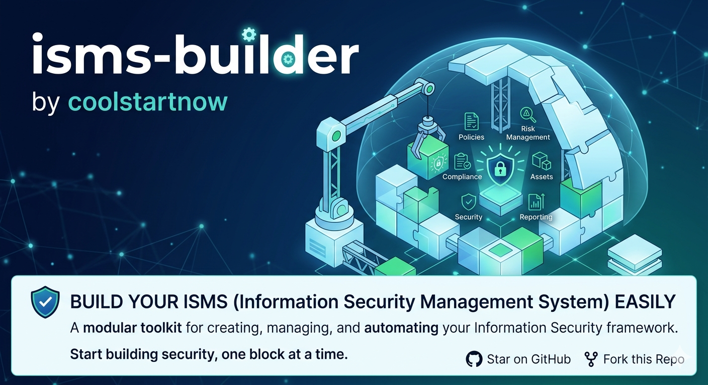

<!-- © 2026 Claude Hecker — ISMS Builder V 1.28 — AGPL-3.0 -->


# ISMS Builder – Dokumentation & Architektur

Stand: 2026-03-09 | Version: V 1.28 (Lieferkettenmodul + Risikomanagement Multi-Framework, GDPR in SPA, Copyright-Header)

---

## Inhaltsverzeichnis

1. Überblick
2. Verzeichnisstruktur
3. Umgebungskonfiguration (.env)
4. Start & Stop
5. SSL/TLS einrichten
6. Backup & Deployment
7. Automatisierte Tests
8. Workspace neu einrichten
9. UI-Zugriffsschutz
10. RBAC & Benutzer
11. Reports & Compliance
12. Statement of Applicability (SoA)
13. Admin-Panel
14. Einstellungen (rollenspezifisch)
15. Öffentliche Vorfallmeldung & Incident Inbox
16. Audit-Log
17. GDPR-Modul
18. Storage-Backend wechseln
19. Troubleshooting
20. Legal & Privacy Modul
21. Dashboard (ISMS-Übersicht)
22. Sicherheitsziele (ISO 27001 Kap. 6.2)
23. Space Hierarchy – Confluence-ähnliche Seitenhierarchie
24. Chrome-Rendering – Bugfixes & Browser-Kompatibilität
25. Papierkorb & Soft-Delete-System
26. Asset Management (ISO 27001 A.5.9–5.12)
27. Governance & Management-Review (ISO 27001 Kap. 9.3)
28. Business Continuity Management (BCM/BCP)
29. Code-Architektur & Refactoring
30. E-Mail-Benachrichtigungen
31. Storage-Backends & Migration (JSON → SQLite → PostgreSQL)
32. Open-Source-Dokumentation & Architektur-Artefakte
33. Lieferkettenmanagement – Multi-Framework
34. Mehrfach-Funktionen pro Benutzer
35. Präsentation
36. Geplante Erweiterungen & offene TODOs
37. Risikomanagement – Multi-Framework

---

## 1. Überblick

Der ISMS Builder ist eine eigenständige Node.js/Express-Anwendung mit Vanilla-JS-SPA zur Erstellung, Verwaltung und Versionierung von ISMS-Dokumenten. Unterstützt werden mehrere Compliance-Frameworks sowie GDPR, Risikomanagement, Training und Reporting.

**Tech-Stack:** Node.js ≥18, Express, JWT, bcryptjs, multer, better-sqlite3
**Persistenz:** JSON-Dateien (Standard), SQLite (empfohlen, `STORAGE_BACKEND=sqlite`), MariaDB/MySQL (`STORAGE_BACKEND=mariadb`), PostgreSQL-Stub (`STORAGE_BACKEND=pg`)
**Auth:** JWT-Cookie (`sm_session`), bcrypt-Passwörter, optionale TOTP-2FA
**RBAC:** `reader`/`revision`(1) < `editor`/`dept_head`/`qmb`(2) < `contentowner`/`auditor`(3) < `admin`(4)
**UI-Schutz:** Alle UI-Seiten außer `login.html` und ihren Abhängigkeiten sind serverseitig durch JWT-Prüfung geschützt. Unauthentifizierte Anfragen werden mit `302 → /ui/login.html` umgeleitet — unabhängig vom Client-seitigen `logincheck.js`.

---

## 2. Verzeichnisstruktur

```
Confluence_ISMS_build/
├── server/
│   ├── index.js              – Express-Setup, UI-Middleware, Router-Einbindung (~180 Zeilen)
│   ├── auth.js               – JWT-Auth, requireAuth, authorize()
│   ├── rbacStore.js          – Benutzer/Passwort-Store (bcrypt)
│   ├── storage.js            – Backend-Façade (json/sqlite)
│   ├── reports.js            – Report-Logik
│   ├── 2faSetup.js           – TOTP-Setup
│   ├── totp.js               – TOTP-Verifikation
│   ├── routes/               – Express-Router (je Modul eine Datei)
│   │   ├── auth.js           – Login, Logout, Whoami, /me/password, 2FA
│   │   ├── templates.js      – Templates + Anhänge + Hierarchie + Entities
│   │   ├── soa.js            – SoA, Crossmap, Frameworks
│   │   ├── risks.js          – Risk & Compliance
│   │   ├── goals.js          – Sicherheitsziele
│   │   ├── assets.js         – Asset Management
│   │   ├── governance.js     – Governance + Dokument-Upload
│   │   ├── bcm.js            – BCM + Dokument-Upload
│   │   ├── calendar.js       – Aggregierter Kalender
│   │   ├── guidance.js       – Guidance + Datei-Upload
│   │   ├── gdpr.js           – GDPR & Datenschutz
│   │   ├── reports.js        – Reports + CSV-Export
│   │   ├── legal.js          – Legal & Privacy
│   │   ├── training.js       – Training & Schulungen
│   │   ├── admin.js          – Admin-Routen + Dashboard
│   │   ├── public.js         – Öffentliche Incident-Meldung
│   │   └── trash.js          – Papierkorb + Export
│   └── db/
│       ├── jsonStore.js      – Template-Store (JSON)
│       ├── sqliteStore.js    – Template-Store (SQLite)
│       ├── database.js       – SQLite-Verbindung + Schema
│       ├── soaStore.js       – SoA-Store (alle Frameworks)
│       ├── entityStore.js    – Konzernstruktur
│       ├── crossmapStore.js  – Cross-Mapping-Gruppen
│       ├── gdprStore.js      – GDPR-Store (8 Sub-Module)
│       ├── riskStore.js      – Risikomanagement
│       ├── guidanceStore.js  – Guidance-Dokumente
│       ├── trainingStore.js  – Schulungen
│       ├── legalStore.js          – Legal-Store (contracts/ndas/privacyPolicies)
│       ├── goalsStore.js          – Sicherheitsziele + KPI-Tracking
│       ├── publicIncidentStore.js – Öffentliche Vorfallmeldungen
│       ├── orgSettingsStore.js    – Organisationseinstellungen
│       ├── auditStore.js          – Audit-Log (append-only)
│       └── customListsStore.js    – Editierbare Dropdown-Listen
├── ui/
│   ├── index.html            – Haupt-SPA
│   ├── app.js                – SPA-Logik (alle Sections)
│   ├── style.css             – Atlassian Dark Theme
│   ├── login.html            – Login + öffentl. Incident-Formular
│   └── logincheck.js         – Auth-Guard für Standalone-Seiten
├── data/
│   ├── templates.json        – Templates
│   ├── soa.json              – SoA-Controls (alle Frameworks)
│   ├── risks.json            – Risikoregister
│   ├── entities.json         – Konzernstruktur
│   ├── rbac_users.json       – Benutzer (bcrypt-Hashes)
│   ├── guidance.json         – Guidance-Metadaten
│   ├── training.json         – Schulungen
│   ├── public-incidents.json – Öffentlich gemeldete Vorfälle
│   ├── org-settings.json     – Organisationseinstellungen
│   ├── custom-lists.json     – Angepasste Dropdown-Listen
│   ├── audit-log.json        – Audit-Log (max. 2000 Einträge)
│   ├── crossmap.json         – Cross-Mapping-Daten
│   ├── gdpr/                 – GDPR-Daten (vvt, av, dsfa, ...)
│   ├── legal/                – Legal-Daten (contracts.json, ndas.json, privacy-policies.json)
│   │   └── files/            – Legal-Datei-Uploads
│   ├── guidance/files/       – Guidance-Uploads (PDF/DOCX)
│   ├── governance-files/     – Governance-Dokument-Uploads
│   ├── bcm-files/            – BCM-Dokument-Uploads
│   ├── assets.json           – Asset-Register
│   ├── governance.json       – Governance (Reviews/Maßnahmen/Sitzungen)
│   ├── bcm.json              – BCM (BIA/Pläne/Übungen)
│   └── template-files/       – Template-Anhänge
├── scripts/
│   ├── clone-clean-workspace.sh  – Workspace einrichten (npm, .env, SSL, Start)
│   ├── backup-and-deploy.sh      – Backup + Deployment-Paket erstellen
│   ├── setup-ssl.sh              – SSL-Modus wählen (HTTP/Self-signed/LE)
│   └── letsencrypt.sh            – Let's Encrypt einrichten/erneuern/Status
├── ssl/                      – Zertifikatsdateien (cert.pem, key.pem)
├── Dockerfile                – Multi-stage Docker-Build
├── docker-compose.yml        – Docker Compose (Bind-Mounts für data/ und ssl/)
├── .env                      – Umgebungskonfiguration (nicht im Git)
├── .env.docker               – Docker-Vorlage
├── start.sh                  – Server starten (PID-Datei, Logging)
└── stop.sh                   – Server stoppen (inkl. Port-Bereinigung)
```

---

## 3. Umgebungskonfiguration (.env)

```env
JWT_SECRET=<min. 32 zufällige Zeichen>   # openssl rand -hex 32
JWT_EXPIRES_IN=8h
PORT=3000
DEV_HEADER_AUTH=false
STORAGE_BACKEND=sqlite                    # sqlite | json | mariadb | postgres

# MariaDB/MySQL (nur wenn STORAGE_BACKEND=mariadb, npm install mysql2 erforderlich)
# DB_HOST=localhost
# DB_PORT=3306
# DB_USER=isms
# DB_PASS=yourpass
# DB_NAME=isms_builder
# DB_SSL=false

# SSL (optional – leer lassen für HTTP)
# SSL_CERT_FILE=ssl/cert.pem
# SSL_KEY_FILE=ssl/key.pem

# SMTP / E-Mail (optional – ohne SMTP_HOST keine Benachrichtigungen)
# SMTP_HOST=smtp.example.com
# SMTP_PORT=587
# SMTP_SECURE=false    # true = TLS (Port 465), false = STARTTLS
# SMTP_USER=isms@example.com
# SMTP_PASS=password
# SMTP_FROM=ISMS Builder <isms@example.com>

# Ollama / KI (optional – für semantische Suche und Scanner-PDF-Import)
# OLLAMA_HOST=localhost          # Ollama-Server-Host (Standard: localhost)
# OLLAMA_PORT=11434              # Ollama-Port (Standard: 11434)
# OLLAMA_MODEL=llama3.2:3b      # Modell für Scanner-PDF-Import (Standard: llama3.2:3b)
# (Embedding-Modell nomic-embed-text wird über Admin → Organisation → KI-Integration konfiguriert)
```

**Wichtig:** `SSL_CERT_FILE` / `SSL_KEY_FILE` nur eintragen wenn HTTPS gewünscht ist. Sind diese Variablen gesetzt, startet der Server als HTTPS – Browser-URL muss dann `https://` verwenden.

Für E-Mail-Benachrichtigungen `SMTP_HOST` und zugehörige Variablen eintragen. Fehlt `SMTP_HOST`, sind alle Benachrichtigungen automatisch deaktiviert (kein Fehler, keine Auswirkung auf Tests). Die Benachrichtigungstypen werden im Admin-Panel unter **Organisation → E-Mail-Benachrichtigungen** gesteuert.

---

## 4. Start & Stop

```bash
bash start.sh          # startet Server, schreibt PID in .server.pid
bash stop.sh           # stoppt Server, bereinigt auch verwaiste Prozesse auf dem Port
```

`start.sh` erkennt automatisch ob SSL aktiv ist und zeigt die korrekte URL (`http://` oder `https://`).

---

## 5. SSL/TLS einrichten

```bash
bash scripts/setup-ssl.sh       # interaktiv: HTTP / Self-signed / Let's Encrypt
bash scripts/letsencrypt.sh     # dediziertes Let's Encrypt Script
bash scripts/letsencrypt.sh renew   # Zertifikat erneuern
bash scripts/letsencrypt.sh status  # Ablaufdatum prüfen
```

**Validierungsmethoden Let's Encrypt:**
- `standalone` – certbot öffnet kurz Port 80 (Server wird gestoppt/gestartet)
- `webroot` – Challenge-Datei in bestehenden Web-Root
- `dns-01` – TXT-Record manuell setzen (kein offener Port, auch für Wildcard)

---

## 6. Backup & Deployment

```bash
bash scripts/backup-and-deploy.sh            # → ~/isms-backup-*.tar.gz + ~/isms-deploy-full-*.tar.gz
bash scripts/backup-and-deploy.sh /pfad/     # Ausgabe in anderes Verzeichnis
```

- **Backup** (ohne node_modules, ~4 MB): Code + Daten für schnelle Sicherung
- **Deploy-Paket** (vollständig, ~9 MB): alles inkl. node_modules, .env, Daten

**Docker-Deployment:**

Das Docker-Image enthält **keinen** `data/`-Ordner — JSON-Daten und Uploads werden als Bind-Mount bereitgestellt:

```
docker-compose.yml (Bind-Mounts):
  ./data:/app/data        # JSON-Dateien + Uploads (vom Host lesbar/sicherbar)
  # ./ssl:/app/ssl:ro     # Optional: SSL-Zertifikate (read-only)
```

Der Entrypoint (`docker-entrypoint.sh`) legt fehlende Unterverzeichnisse beim Start automatisch an:
```
/app/data/gdpr/files  /app/data/guidance/files
/app/data/template-files  /app/data/legal/files
```

```bash
docker compose up -d --build    # Image bauen und starten
docker compose logs -f          # Logs verfolgen
docker compose down             # stoppen
```

**Backup im Docker-Betrieb** (Host-seitig, kein `docker exec` nötig):
```bash
tar czf ~/isms-data-$(date +%F).tar.gz ./data
```

---

## 7. Automatisierte Tests

> **Hinweis:** Die Test-Suite unter `tests/` sind persönliche Entwicklungstests des Autors,
> die aus Transparenzgründen mit dem Projekt ausgeliefert werden. Sie sind **kein Bestandteil
> der Anwendung** und zum Betrieb von ISMS Builder **nicht erforderlich**. Die Tests prüfen
> internes API-Verhalten und verwenden fest kodierte Test-Zugangsdaten, die ausschließlich
> in einer isolierten Testumgebung existieren — ohne jeden Bezug zu Produktiv- oder Demo-Daten.

**Stack:** Jest + Supertest | **Ausführung:** sequenziell (`--runInBand`)

```bash
npm test                # alle Tests einmalig
npm run test:watch      # Watch-Modus
npm run test:coverage   # mit Coverage-Report
```

**Struktur:**

```
tests/
  setup/
    testEnv.js      – Erstellt isoliertes Temp-Datenverzeichnis mit Seed-Nutzern (bcrypt 1 Runde)
    authHelper.js   – loginAs(), authedGet/Post/Put/Delete()
  auth.test.js      – Login (korrekt/falsch/TOTP), JWT-Schutz, Whoami, Logout
  rbac.test.js      – Rollendurchsetzung pro Modul (Templates, Risiken, Guidance, Ziele, Admin)
  templates.test.js – Template CRUD, Lifecycle, Versionshistorie, Anhänge
  soa.test.js       – SoA lesen/filtern/bearbeiten, Cross-Mapping
  risks.test.js     – Risiko CRUD + Behandlungspläne (auditor-Enforcement)
  gdpr.test.js      – VVT, AV, DSFA, Datenpannen, DSAR, TOMs, Dashboard
  goals.test.js     – Sicherheitsziele CRUD, KPI-Progress-Berechnung
  reports.test.js   – Report-Endpunkte Smoke-Test, Dashboard, Kalender
  admin.test.js     – Benutzerverwaltung, Konzernstruktur, Org-Einstellungen, Audit-Log
```

**Datenisolation:** Jede Testdatei bekommt ein eigenes `mkdtemp`-Verzeichnis mit frischen Seed-Daten. `DATA_DIR`-Umgebungsvariable wird vor dem Server-Require gesetzt — alle Stores lesen diesen Pfad beim Laden. Temp-Dirs werden in `afterAll` gelöscht.

**Aktueller Stand:** 265/265 Tests bestehen.

---

## 8. Workspace neu einrichten

```bash
bash scripts/clone-clean-workspace.sh         # interaktiv
bash scripts/clone-clean-workspace.sh --yes   # alle Defaults
```

Schritte: Systemcheck → Verzeichnisse anlegen → .env generieren → npm install → SSL (optional) → Start

---

## 9. UI-Zugriffsschutz

Alle UI-Seiten sind serverseitig durch eine Express-Middleware in `server/index.js` geschützt:

| Datei | Zugang |
|---|---|
| `login.html` | Öffentlich (Login + Incident-Meldeformular) |
| `style.css`, `logincheck.js`, `login-submit.js`, `qr2fa.js` | Öffentlich (Abhängigkeiten der Login-Seite) |
| `index.html`, `app.js` | **Nur mit gültigem JWT-Cookie** |

Unauthentifizierte Anfragen auf geschützte Dateien werden mit `HTTP 302 → /ui/login.html` umgeleitet. Die client-seitige Prüfung in `logincheck.js` bleibt als zusätzliche Schicht erhalten, ist aber nicht der primäre Schutz.

**Stale-Cookie-Schutz (Chrome bfcache):** Beim Abrufen von `login.html` löscht der Server aktiv das `sm_session`-Cookie (`res.clearCookie`). Dies verhindert, dass Chrome einen abgelaufenen JWT aus dem Back/Forward-Cache wiederherstellt und Seiteninhalt aufgrund eines stillen 401 ausgeblendet wird.

---

## 10. RBAC & Benutzer

> **Hinweis – Angepasstes RBAC-Modell:** Die Zugriffssteuerung des ISMS Builders ist eine **maßgeschneiderte Erweiterung** des klassischen rollenbasierten Zugriffsmodells (RBAC). Gegenüber einem Standard-RBAC wurden folgende Anpassungen vorgenommen:
>
> 1. **Zusätzliche Rollen mit spezifischer Normbasis:** Neben den üblichen Rollen `reader`/`editor`/`admin` wurden dedizierte Rollen für den deutschen/europäischen Rechts- und Normkontext eingeführt: `revision` (Interne Revision, weisungsungebunden per IDW/AktG), `qmb` (Qualitätsmanagementbeauftragter, ISO 9001:2015 Kap. 5.3), `dept_head` (Abteilungsleiter) und `auditor` (ICS/OT-Sicherheit, IEC 62443 / NIS2). Diese Rollen existieren in keinem Standard-RBAC-Framework.
>
> 2. **Zweischichtiges Modell (Rang + Funktion):** Zusätzlich zum Zugriffsrang (`role`) trägt jeder Benutzer ein Array organisatorischer Funktionen (`functions[]`), das unabhängig vom Rang gesteuert wird. Dieses zweite Layer löst das reale Problem der **Personalunion** (eine Person ist gleichzeitig CISO und DSB) ohne Duplikation von Rechten oder Schaffung von Sonderrollen. Standard-RBAC-Implementierungen kennen dieses Konzept nicht.
>
> 3. **Normative Begründung:** Die Trennung orientiert sich an ISO 27001:2022 Kap. 5.3 (Rollen und Verantwortlichkeiten) sowie DSGVO Art. 37–39 (Unabhängigkeit des DSB) und NIS2-Umsetzungsgesetz (Sicherheitsverantwortliche).

### Rollenmatrix

| Rolle | Rang | Organisatorische Funktion | Rechte |
|---|---|---|---|
| `reader` | 1 | Allgemeiner Lesezugriff, Management | Lesen aller Module |
| `revision` | 1 | **Interne Revision** – weisungsungebunden, read-only | Identisch mit `reader`; eigene Rollensemantik für Prüfungsnachweise |
| `editor` | 2 | Fachabteilungen, Policy-Autoren | + Templates bearbeiten/Status ändern, SoA-Controls bearbeiten, GDPR VVT + DSAR, Sicherheitsziele, Training, Anhänge |
| `dept_head` | 2 | Abteilungsleiter | Identisch mit `editor` |
| `qmb` | 2 | **Qualitätsmanagementbeauftragter** | Identisch mit `editor`; zuständig für QM-Templates und Training |
| `contentowner` | 3 | **CISO / ISB** und **DSB / GDPO** | + Templates erstellen/genehmigen/verschieben, Guidance, GDPR (AV/DSFA/TOMs/DSB), Legal, Incident-Inbox, **Risiken anlegen und bearbeiten**, alle Einstellungen |
| `auditor` | 3 | **ICS/OT-Sicherheitsverantwortlicher**, Risk-Auditor | Wie `contentowner` + explizit für Risikoverwaltung optimiert; GDPR-Datenpannen |
| `admin` | 4 | Systemadministrator | Alles + Löschen/Papierkorb, Benutzerverwaltung, Admin-Panel |

### Zweischichtiges Rollen-Modell (RBAC-Rang + Organisatorische Funktion)

Das System trennt **Zugriffsrechte** (RBAC-Rang) von **organisatorischen Funktionen** konsequent:

- **RBAC-Rang** (`role`): bestimmt was ein Benutzer im System tun darf — ein einziger Wert
- **Funktionen** (`functions[]`): beschreibt welche organisatorischen Rollen eine Person innehat — beliebig viele

Ein Benutzer kann also gleichzeitig **CISO und DSB** sein (in KMU und Konzernen häufig), ohne dass dafür RBAC-Rechte dupliziert werden müssen.

### Vordefinierte Funktionen

| Funktions-ID | Bezeichnung | Auswirkung |
|---|---|---|
| `ciso` | Chief Information Security Officer / ISB | Menü-Freischaltung (s.u.) + E-Mail-Digest Risiken + BCM; CISO-Einstellungen |
| `dso` | Datenschutzbeauftragter (DSB/DPO) | Menü-Freischaltung (s.u.) + E-Mail-Digest DSAR + GDPR-Vorfälle; DSB-Einstellungen |
| `revision` | Interne Revision | Menü-Freischaltung (s.u.) — weisungsungebunden, read-only |
| `qmb` | Qualitätsmanagementbeauftragter | Menü-Freischaltung (s.u.) + QM-Einstellungen |
| `bcm_manager` | BCM-Manager | — (zukünftige Erweiterung) |
| `dept_head` | Abteilungsleiter | — |
| `auditor` | Interner Auditor | — |
| `admin_notify` | Admin-Benachrichtigung | E-Mail-Digest Verträge + Template-Reviews |

**Mehrfachfunktionen / Personalunion:** Eine Person mit `ciso` + `dso` bekommt beide Digest-E-Mails und sieht die Vereinigungsmenge beider Menüs. Der RBAC-Rang bleibt unabhängig davon.

### Funktionsbasierte Menü-Sichtbarkeit (UI)

Die Sichtbarkeit von Navigationseinträgen folgt einer zweidimensionalen Regel:

> **Sichtbar wenn:** RBAC-Rang ≥ Mindestring des Moduls **ODER** Benutzerfunktion liegt in der erlaubten Funktionsliste des Moduls **ODER** Rolle = admin

**Implementierung:** `canSeeSection(meta)` in `ui/app.js` — wertet `meta.minRole` (Rang-Check) und `meta.functions[]` (Funktions-Check) aus. Die `populateSectionNav()`-Funktion und `loadSection()` nutzen diese Guard.

| Modul | Mindestring | Freischalten auch via Funktion |
|---|---|---|
| Dashboard, SoA, Guidance, Training, Kalender | reader | — (immer sichtbar) |
| Risk & Compliance | editor (rank 2) | `ciso`, `revision`, `qmb` |
| Asset Management | editor (rank 2) | `ciso`, `revision` |
| Sicherheitsziele | contentowner (rank 3) | `ciso`, `dso`, `revision`, `qmb` |
| GDPR & Datenschutz | contentowner (rank 3) | `dso`, `revision` |
| Legal & Privacy | contentowner (rank 3) | `ciso`, `dso` |
| Incident Inbox | contentowner (rank 3) | `ciso` |
| Lieferkette | contentowner (rank 3) | `ciso`, `revision` |
| Business Continuity | contentowner (rank 3) | `ciso`, `revision` |
| Governance | contentowner (rank 3) | `ciso`, `dso`, `revision`, `qmb` |
| Reports | contentowner (rank 3) | `ciso`, `dso`, `revision`, `qmb` |
| Einstellungen | contentowner (rank 3) | `ciso`, `dso`, `revision`, `qmb` |
| Admin-Konsole | admin (rank 4) | — |

**Sonderfälle kombinierter Funktionen (Personalunion):**

| Kombination | Menü-Ergebnis |
|---|---|
| `ciso` + `dso` | Alles außer Admin-Konsole (typisch: KMU-CISO ist gleichzeitig DSB) |
| `ciso` + `revision` | Alles außer GDPR/Legal/Admin |
| `dso` + `qmb` | GDPR, Legal, Governance, SoA, Risiken, Ziele, Training, Reports |
| `dept_head` (Rolle) + `ciso` (Funktion) | Volle CISO-Ansicht trotz Rang 2 |

**Menü-Ansicht nach Demo-Benutzer:**

| User | Rolle | Funktion | Sichtbare Module |
|---|---|---|---|
| admin (admin@example.com) | admin | ciso, dso | Alle (admin) |
| alice (alice@it.example) | dept_head | — | Dashboard, SoA, Guidance, Training, Kalender, Risiken, Assets |
| bob (bob@hr.example) | reader | — | Dashboard, SoA, Guidance, Training, Kalender |

### Organisatorische Zuordnung (empfohlen)

| Funktion | Empfohlene Rolle | Norm / Grundlage | Weisungsungebunden? |
|---|---|---|---|
| CISO / ISB | `contentowner` + Funktion `ciso` | ISO 27001 | Nein |
| DSB / GDPO | `contentowner` + Funktion `dso` | DSGVO Art. 37 (Pflicht) | **Ja** |
| ICS/OT-Sicherheitsverantwortlicher | `auditor` | IEC 62443, NIS2 | Nein |
| Interne Revision | `revision` | AktG § 91, IDW PS 321 | **Ja** |
| QMB | `qmb` + Funktion `qmb` | ISO 9001:2015 Kap. 5.3 | Nein |
| Fachabteilungen, Policy-Autoren | `editor` | — | Nein |
| Abteilungsleiter | `dept_head` + Funktion `dept_head` | — | Nein |
| Systemadministration | `admin` | — | Nein |

> **Risikomanagement:** Sowohl `contentowner` (CISO) als auch `auditor` (ICS/OT) dürfen Risiken anlegen und bearbeiten (Rang ≥ 3). `editor` und `reader` haben keinen Schreibzugriff auf das Risikoregister.

> **DSB und Interne Revision** sind per Gesetz/Best Practice weisungsungebunden. Die Rolle `revision` hat Rang 1 (read-only) — sie kann keine Produktionsdaten verändern, nur prüfen und dokumentieren (außerhalb des Systems).

### Technische Umsetzung

```json
// data/rbac_users.json – Beispiel CISO + DSB in Personalunion
{
  "max.mustermann": {
    "username": "max.mustermann",
    "email": "max@firma.de",
    "role": "contentowner",
    "functions": ["ciso", "dso"],
    ...
  }
}
```

**Relevante Dateien:**
- `server/rbacStore.js` — `functions[]` in createUser/updateUser; `getUsersByFunction(fn)` für Notifier
- `server/auth.js` — `functions[]` wird aus JWT geladen und als `req.functions` weitergegeben
- `server/routes/auth.js` — `/login` und `/whoami` geben `functions[]` zurück
- `server/notifier.js` — `getRecipients(fn, fallback)` sucht Empfänger per Funktion; Org-Setting ist Fallback
- `ui/app.js` — `getCurrentFunctions()`, `hasFunction(fn)`, Funktions-Badges in Topbar

**Admin-Panel → Benutzer:** Checkbox-Grid mit allen 7 Funktionen; Funktions-Chips in der Benutzertabelle.

**Einstellungen-Panel:** CISO-Sektion erscheint wenn `hasFunction('ciso')` **oder** RBAC-Rang ≥ contentowner; DSB-Sektion analog.

Benutzer werden in `data/rbac_users.json` als bcrypt-Hashes gespeichert. Verwaltung im **Admin-Panel → Benutzer**.

---

## 11. Reports & Compliance

**7 Report-Typen:**

| Typ | Beschreibung | CSV | Entitäts-Filter |
|---|---|---|---|
| `compliance` | Implementierungsrate pro Gesellschaft & Framework | ✓ | ✓ |
| `framework` | Controls pro Framework: applicable / implementiert / Gap | ✓ | — |
| `gap` | Controls ohne verknüpfte Policy-Templates | ✓ | ✓ |
| `templates` | Alle Templates nach Status und Gesellschaft | ✓ | ✓ |
| `reviews` | Überfällige und kommende Template-Reviews | ✓ | — |
| `matrix` | Compliance-Matrix: Control × Gesellschaft (Ampelfarben) | ✓ | Framework |
| `audit` | Status-Änderungen an Templates im Zeitraum | — | — |

**Endpunkte:**
```
GET /reports/compliance     – Compliance pro Gesellschaft
GET /reports/framework      – Framework-Abdeckung
GET /reports/gap            – Gap-Analyse
GET /reports/templates      – Template-Übersicht
GET /reports/reviews        – Fällige Reviews (?days=30)
GET /reports/matrix         – Compliance-Matrix (?framework=)
GET /reports/audit          – Audit-Trail (?from=&to=)
GET /reports/export/csv     – CSV-Export ?type=...&entity=...&framework=...
```

---

## 12. Statement of Applicability (SoA)

> ### ⚠ RECHTLICHER HINWEIS: ISO-Controls erfordern manuelle Installation durch den Administrator
>
> **ISO 27001:2022, ISO 9000:2015 und ISO 9001:2015** sind urheberrechtlich geschützte Normen der
> International Organization for Standardization (ISO). Die vollständigen Control-Definitionen
> (Titel, Beschreibung, Anforderungstext) **sind nicht Bestandteil dieser Software** und dürfen
> ohne Lizenz **nicht weitergegeben oder redistribuiert werden**.
>
> **Was das für den Betrieb bedeutet:**
> Die SoA-Module für ISO 27001, ISO 9000 und ISO 9001 werden ohne Norminhalte ausgeliefert.
> Der Administrator muss die Controls **eigenhändig** importieren:
>
> 1. Lizenzierte Kopie der Norm beschaffen: [iso.org](https://www.iso.org/) oder autorisierter Händler
> 2. JSON-Datei mit den Control-Definitionen vorbereiten (Format: siehe `scripts/import-iso-controls.sh`)
> 3. Importer ausführen:
>    ```bash
>    bash scripts/import-iso-controls.sh /pfad/zur/iso-controls.json
>    ```
> 4. Server neu starten
>
> **Enthaltene Frameworks (keine ISO-Lizenz erforderlich):**
> BSI IT-Grundschutz, EU NIS2, EUCS, EU AI Act und CRA basieren auf öffentlich verfügbaren
> EU-Rechtsakten bzw. Bundesbehörden-Veröffentlichungen und sind vollständig vorinstalliert.
>
> **Rechtsgrundlage:** ISO-Normen sind nach dem Urheberrecht (UrhG § 2, Art. 2 Berner Übereinkunft)
> geschützt. Unbefugte Vervielfältigung oder öffentliche Zugänglichmachung — auch im internen
> Betrieb ohne Lizenz — ist unzulässig.

**Frameworks (313 Controls gesamt):**

| ID | Name | Controls |
|---|---|---|
| ISO27001 | ISO 27001:2022 Annex A | 93 |
| BSI | BSI IT-Grundschutz | 66 |
| NIS2 | EU NIS2 | 10 |
| EUCS | EU Cloud (EUCS) | 23 |
| EUAI | EU AI Act | 18 |
| ISO9000 | ISO 9000:2015 | 12 |
| ISO9001 | ISO 9001:2015 | 66 |
| CRA | EU Cyber Resilience Act | 33 |

**Merge-Logik:** Neue Frameworks werden beim Serverstart automatisch in bestehende `soa.json` eingetragen (kein Datenverlust, keine manuelle Migration).

**Endpunkte:**
```
GET  /soa/frameworks                  – Frameworks (ID, Label, Farbe)
GET  /soa                             – alle Controls (?framework=, ?theme=)
GET  /soa/summary                     – Umsetzungsrate pro Framework
PUT  /soa/:id                         – Standard-Control aktualisieren (editor+)
GET  /soa/export                      – JSON-Export
GET  /soa/crossmap                    – Cross-Mapping-Gruppen

POST /soa/custom                      – Custom Control anlegen (contentowner+)
PUT  /soa/custom/:id                  – Custom Control bearbeiten (contentowner+)
DELETE /soa/custom/:id                – Custom Control löschen (contentowner+)

GET  /soa/import-controls/status      – ISO-Import-Status prüfen (admin)
POST /soa/import-controls             – ISO-Controls importieren (admin) → { controls: [...] }
GET  /admin/soa-frameworks            – Framework-Aktivierung lesen
PUT  /admin/soa-frameworks            – Framework-Aktivierung setzen
```

### Custom Controls

Organisationen können eigene Controls anlegen — z.B. interne Vorgaben, branchenspezifische Anforderungen oder Sonderanforderungen die keinem der acht Standard-Frameworks zugeordnet sind.

| Feld | Beschreibung |
|---|---|
| `id` | Automatisch generiert, Präfix `CUSTOM-` |
| `framework` | Immer `CUSTOM` |
| `title` | Freitext-Titel des Controls |
| `theme` | Themengruppe (frei wählbar) |
| `applicable` | true / false |
| `status` | not_applicable / planned / partial / implemented |
| `owner` | Verantwortlicher |
| `justification` | Begründung |
| `linkedTemplates` | Verknüpfte Richtlinien |

**RBAC:** Anlegen, bearbeiten und löschen erfordert mindestens `contentowner` (Rang 3).

**Lösch-Schutz:** Ein Custom Control kann nur gelöscht werden wenn keine Templates damit verknüpft sind. Andernfalls gibt die API `409 Conflict` mit dem Hinweis welche Templates betroffen sind.

**ISO-Controls-Import (API):**

Neben dem Bash-Script `scripts/import-iso-controls.sh` gibt es eine API-Route für den Import:
```
POST /soa/import-controls
Content-Type: application/json
{ "controls": [ { "id": "ISO-5.1", "framework": "ISO27001", "title": "...", ... } ] }
```
Status prüfen (wieviele Controls pro Framework vorhanden): `GET /soa/import-controls/status`

### Modulübergreifende Traceability (Control- & Policy-Verknüpfungen)

Jeder Eintrag in allen Modulen kann mit SoA-Controls und Richtlinien (Templates) verknüpft werden. Dies gewährleistet die **lückenlose Rückverfolgbarkeit** aller ISMS-Maßnahmen auf Compliance-Anforderungen — ein Pflichtbestandteil nach ISO 27001 Kap. 6.1.3 (Statement of Applicability) und für Auditoren.

| Feld | Typ | Bedeutung |
|---|---|---|
| `linkedControls` | Array von Control-IDs | Verknüpfte SoA-Controls (z.B. `["ISO-5.9","BSI-ORP.3"]`) |
| `linkedPolicies` | Array von Template-IDs | Verknüpfte Richtlinien/Policy-Dokumente |

**Unterstützte Module:**

| Modul | linkedControls | linkedPolicies |
|---|---|---|
| Templates (Richtlinien) | ✅ | ✅ (bidirektional mit SoA) |
| SoA-Controls | ✅ | ✅ (bidirektional mit Templates) |
| Risiken | ✅ | ✅ |
| Sicherheitsziele | ✅ | ✅ |
| Assets | ✅ | ✅ |
| BCM (BIA, Pläne, Übungen) | ✅ | ✅ |
| Governance (Reviews, Maßnahmen, Sitzungen) | ✅ | ✅ |
| Training | ✅ | ✅ |
| GDPR (VVT, AV, DSFA, TOMs) | ✅ | ✅ |
| Legal (Verträge, NDAs, Policies) | ✅ | ✅ |
| Guidance | ✅ | — (Guidance-Docs sind selbst Richtlinien) |

**UI:** In jedem Edit-Formular gibt es einen aufklappbaren Abschnitt „🔗 Verknüpfungen" mit:
- Control-Picker: gefilterter `<select multiple>` aller aktiven SoA-Controls mit Freitextsuche
- Policy-Picker: `<select multiple>` aller Templates (nach Typ gruppiert)
- Ausgewählte Verknüpfungen werden als entfernbare Chips angezeigt

**Auswirkung auf Reports:** Der Gap-Report (`GET /reports/gap`) zeigt Controls ohne verknüpfte Policies. Die Compliance-Matrix berücksichtigt `linkedControls` aller Module.

---

## 13. Admin-Panel (minRole: admin)

8 Tabs:

| Tab | Inhalt |
|---|---|
| **Benutzer** | Anlegen, bearbeiten, löschen; Rollen-Badges; Funktions-Checkboxen (ciso, dso, qmb, bcm_manager, dept_head, auditor, admin_notify) |
| **Gesellschaften** | Konzernstruktur (Holding + Töchter), Baum-CRUD |
| **Vorhandene Templates** | Alle Templates mit Löschen-Funktion |
| **Listen** | 6 editierbare Dropdown-Listen: Template-Typen, Risikokategorien, Risikobehandlungen, GDPR-Datenkategorien, GDPR-Betroffenentypen, Vorfallsarten |
| **Organisation** | Org-Name, ISMS-Scope, CISO/DSB-Kontakt; Sicherheitsrichtlinien (2FA-Pflicht); SMTP-Konfiguration + Test-Mail; Navigationsreihenfolge (Drag & Drop); **Richtlinien-Bestätigung** (policyAckMode); E-Mail-Benachrichtigungen |
| **Audit-Log** | Filterbar nach User/Aktion/Ressource/Datum, Pagination, löschbar |
| **Wartung** | Vollexport (JSON), Cleanup verwaister Anhänge, **Demo-Reset**, **Demo-Import**, **Scanner-Import-Status** |
| **System-Konfiguration** | 13 Modul-Toggles (soa, guidance, goals, risk, legal, incident, gdpr, training, reports, calendar, assets, governance, bcm, suppliers) + 8 SoA Framework-Toggles. Mindestens 1 Framework muss aktiv bleiben. **KI-Integration** (Ollama-URL, Embedding-Modell). |

### Organisation-Tab (Details)

Der Organisation-Tab enthält folgende Sektionen:

| Sektion | Felder / Funktion |
|---|---|
| **Organisationsdaten** | Org-Name, Kürzel, ISMS-Scope, Logo-Text |
| **Verantwortlichkeiten** | CISO-Name/E-Mail, GDPO-Name/E-Mail, ICS-Kontakt |
| **Sicherheitsrichtlinien** | 2FA systemweit erzwingen (blockiert Login ohne TOTP) |
| **KI-Integration** | Ollama-URL (leer = localhost:11434), Embedding-Modell (leer = nomic-embed-text), globaler KI-Toggle |
| **SMTP-Konfiguration** | Host, Port, TLS, User, Passwort, Absenderadresse; Test-Mail-Button; Hinweis wenn .env-Variablen Vorrang haben |
| **Splash-Screen** | Aktivieren/deaktivieren, Anzeigedauer (1–30 Sek.) |
| **Sprach-Konfiguration** | Aktivierte Sprachen (DE/EN/FR/NL), Standard-Sprache für Login-Seite |
| **Navigationsreihenfolge** | Drag & Drop oder ↑↓-Buttons; Reset auf Standard |
| **Richtlinien-Bestätigung** | `policyAckMode`: email_campaign / manual / distribution_only (nur admin) |
| **E-Mail-Benachrichtigungen** | Globaler Toggle; Einzelne Typen: Risiken (→ CISO), DSAR/GDPR-Vorfälle (→ GDPO), Verträge/Templates/Lieferanten-Audits (→ Admin), BCM-Tests, Löschprotokoll |

### API-Endpunkte (Admin)

```
GET  /admin/users              – Benutzerliste
POST /admin/users              – Benutzer anlegen
PUT  /admin/users/:id          – Benutzer bearbeiten
DELETE /admin/users/:id        – Benutzer löschen

GET  /admin/lists              – alle editierbaren Listen
PUT  /admin/list/:listId       – Liste speichern
POST /admin/list/:listId/reset – Liste auf Standard zurücksetzen

GET  /admin/org-settings       – Organisations-Einstellungen lesen
PUT  /admin/org-settings       – Organisations-Einstellungen speichern

GET  /admin/security           – 2FA-Enforcement-Status
PUT  /admin/security           – 2FA-Enforcement setzen

GET  /admin/modules            – Modul-Konfiguration
PUT  /admin/modules            – Modul-Konfiguration speichern
GET  /admin/soa-frameworks     – Framework-Aktivierung
PUT  /admin/soa-frameworks     – Framework-Aktivierung setzen

GET  /admin/ack-settings       – Policy-Bestätigungs-Modus lesen
PUT  /admin/ack-settings       – Policy-Bestätigungs-Modus setzen (admin)

GET  /admin/audit-log          – Audit-Log (paginiert, filterbar)
DELETE /admin/audit-log        – Audit-Log-Einträge löschen

GET  /admin/export             – Vollexport aller Daten als JSON
POST /admin/maintenance/cleanup – verwaiste Anhänge löschen

GET  /admin/scan-import/status – Scanner-Import-Verlauf
POST /admin/scan-import/upload – Greenbone XML/PDF hochladen (auditor+)

POST /admin/email/test         – Test-Mail senden
GET  /admin/email/status       – SMTP-Konfigurations-Status

POST /admin/demo-reset         – Demo-Daten zurücksetzen (Prompt: "RESET")
POST /admin/demo-import        – Demo-Bundle wiederherstellen
GET  /auth/demo-reset-done     – Prüfen ob Reset-Flag aktiv (öffentlich)
```

---

## 14. Einstellungen (rollenspezifisch, minRole: contentowner)

| Abschnitt | Felder |
|---|---|
| **CISO / ISB** | Eskalations-E-Mail, Response-SLA (Std.), Meldepflicht-Schwelle, meldepflichtige Vorfallsarten |
| **DSB / GDPO** | DSAR-Frist (Tage), verlängerte Frist, 72h-Meldepflicht, Datenschutzbehörde, Standard-Antworttext |
| **ICS / OT** | Verantwortlicher, E-Mail, OT-Scope, Standard (IEC 62443/VDI 2182/NAMUR/BSI), NIS2-Sektor, KRITIS-Flag, Netzwerksegmentierungsstatus, Patch-Zyklus (Wochen), Wartungsfenster, Notfallkontakt |
| **Interne Revision** | Revisionsleiter, E-Mail, Prüfungsumfang, Berichtsempfänger (GF/AR/Prüfungsausschuss), Prüfungsrhythmus, letztes/nächstes Audit-Datum, externer WP |
| **QMB / Qualitätsmanagement** | QMB, E-Mail, QMS-Scope, Norm (ISO 9001/IATF 16949/ISO 13485/AS9100), Zertifizierungsstelle, Zertifikat-Gültigkeit, Audit-Termine, Rezertifizierungsdatum |

**Hinweis zu Weisungsungebundenheit:** DSB und Interne Revision sind per Gesetz bzw. Best Practice weisungsungebunden — sie berichten direkt an GF oder Aufsichtsrat, unabhängig von CISO oder Fachabteilungen. Nicht besetzte Positionen werden im UI mit einem Warnhinweis angezeigt.

### Persönliche Einstellungen (Passwort & 2FA)

Jeder Benutzer erreicht seine persönlichen Einstellungen über **Benutzermenü → Einstellungen** (oben rechts) oder über den Sidebar-Eintrag **Einstellungen**. Der Bereich erscheint ganz oben in der Einstellungsseite und umfasst:

| Bereich | Funktion |
|---|---|
| **Passwort ändern** | Aktuelles Passwort eingeben, neues Passwort (min. 6 Zeichen) zweimal bestätigen; `PUT /me/password` |
| **2FA einrichten** | QR-Code wird automatisch geladen (TOTP); Authenticator-App scannen; 6-stelligen Code eingeben → Aktivieren |
| **2FA deaktivieren** | Button erscheint, wenn 2FA bereits aktiv ist; Bestätigungsdialog |

**2FA-Topbar-Chip:** Ist für den angemeldeten Benutzer keine 2FA eingerichtet, erscheint in der Topbar (zwischen Suche und Benutzer-Avatar) ein dauerhafter orangefarbener Chip **„2FA nicht aktiv"**. Dieser verschwindet erst nach erfolgreicher 2FA-Aktivierung — er kann nicht weggeklickt werden.

**API-Endpunkte (persönliche Einstellungen):**
```
PUT /me/password  – eigenes Passwort ändern (requireAuth) → { currentPassword, newPassword }
```

### 2FA-Enforcement (systemweit)

Im Admin-Panel → Tab **Organisation** → Sektion **Sicherheitsrichtlinien** kann der Administrator die Zwei-Faktor-Authentifizierung für alle Benutzer verpflichtend machen:

| Zustand | Verhalten |
|---|---|
| 2FA-Pflicht **deaktiviert** (Standard) | Benutzer ohne 2FA können sich anmelden; in der Topbar erscheint ein persistenter Warnchip mit Link zu den Einstellungen |
| 2FA-Pflicht **aktiviert** | Benutzer ohne eingerichtete 2FA werden beim Login mit Code `ENFORCE_2FA` und erklärendem Hinweis abgewiesen |

**Wichtig:** Vor der Aktivierung der 2FA-Pflicht sicherstellen, dass alle Benutzerkonten bereits 2FA eingerichtet haben — andernfalls werden betroffene Accounts sofort gesperrt.

**API-Endpunkte:**
```
GET  /admin/security   – 2FA-Enforcement-Status lesen (reader+)
PUT  /admin/security   – 2FA-Enforcement setzen (admin) → { require2FA: true/false }
GET  /whoami           – gibt has2FA: true/false zurück
POST /login            – gibt has2FA: true/false zurück; 403 + code: ENFORCE_2FA wenn Pflicht greift
```

---

## 15. Öffentliche Vorfallmeldung & Incident Inbox

Auf der Login-Seite gibt es einen **"Sicherheitsvorfall melden"**-Button (kein Login nötig).

```
POST   /public/incident         – Vorfall melden (anonym, kein Auth)
GET    /public/incidents        – CISO-Inbox (contentowner+)
GET    /public/incident/:id     – Einzelvorfall (contentowner+)
PUT    /public/incident/:id     – Vorfall bearbeiten/zuweisen (contentowner+)
DELETE /public/incident/:id     – Vorfall löschen (admin)
GET    /public/entities         – Gesellschaftsliste für Formular (kein Auth)
```

Referenznummer: `INC-YYYY-NNNN` (automatisch hochgezählt)

**Löschen (Admin):** Der rote Löschen-Button erscheint in der Detail-Ansicht der Inbox **nur für Administratoren**. contentowner/CISO sehen den Button nicht. Jede Löschung wird im Audit-Log protokolliert.

**CISO-Felder (bearbeitbar):**

| Feld | Werte |
|---|---|
| `status` | new → in_review → assigned → closed |
| `assignedTo` | it / datenschutz |
| `reportable` | tbd / yes / no |
| `cisoNotes` | Freitext |

---

## 16. Audit-Log

Schreibgeschützter, append-only Log mit max. 2000 Einträgen (rolling).

**Protokollierte Aktionen:**

| Ressource | Aktionen |
|---|---|
| `template` | create, update, delete, move |
| `risk` | create, update, delete |
| `user` | create, update, delete |
| `public-incident` | delete |
| `guidance`, `training`, `goals`, `legal` | create, update, delete |
| System | export, settings-change |

```
GET    /admin/audit-log   – Abfrage mit Filtern (?user=&action=&resource=&from=&to=, admin)
DELETE /admin/audit-log   – Log leeren (admin)
```

---

## 17. GDPR-Modul

Vollständig in die Haupt-SPA (`index.html` / `app.js`) integriert — kein separates HTML-Dokument.
Aufruf: `loadSection('gdpr')` → `renderGDPR()`, identisch zum Muster aller anderen vollseitigen Module (Risk, BCM, Assets, Legal usw.).
9 Tabs: overview | vvt | av | dsfa | incidents | dsar | toms | deletion | dsb

```
GET /gdpr/dashboard               – KPI-Übersicht
GET/POST/PUT/DELETE /gdpr/vvt/:id
GET                 /gdpr/vvt/export/csv   – CSV-Export VVT
GET/POST/PUT/DELETE /gdpr/av/:id
GET/POST/PUT/DELETE /gdpr/dsfa/:id
GET/POST/PUT/DELETE /gdpr/incidents/:id
GET/POST/PUT/DELETE /gdpr/dsar/:id
GET/POST/PUT/DELETE /gdpr/toms/:id
GET/PUT             /gdpr/dsb
POST                /gdpr/dsb/upload

– Löschprotokoll (Art. 17 DSGVO) –
GET  /gdpr/deletion-log           – Alle protokollierten Löschungen (reader+)
GET  /gdpr/deletion-log/due       – Überfällige Löschfristen
GET  /gdpr/deletion-log/upcoming  – Bald fällige Löschfristen (?days=90)
POST /gdpr/deletion-log           – Löschung bestätigen (contentowner+)
```

**Löschprotokoll-Logik:** VVT-Einträge mit `retentionMonths` erhalten ein automatisches Ablaufdatum. Abgelaufene Einträge erscheinen als Aufgabe im Tab und im globalen Kalender.

---

## 18. Storage-Backend wechseln

**Empfehlung:** SQLite für Produktion, JSON nur für Entwicklung und Tests.
Ausführliche Migrations-Anleitung inkl. PostgreSQL-Roadmap: **→ Abschnitt 31**.

**Schnellübersicht JSON → SQLite:**
```bash
bash stop.sh
STORAGE_BACKEND=sqlite   # in .env setzen
node tools/migrate-json-to-sqlite.js
bash start.sh
```

---

## 19. Troubleshooting

| Problem | Lösung |
|---|---|
| Port 3000 belegt | `bash stop.sh` (bereinigt auch verwaiste Prozesse) |
| UI nicht erreichbar (weiße Seite) | Prüfen ob SSL aktiv: `grep SSL .env` → ggf. `https://` statt `http://` |
| Server startet nicht | `cat .server.log` für Fehlermeldung |
| Seite (Legal, Reports) kurz leer in Chrome | Behoben: Skeleton-First-Pattern + bfcache-Handler in `app.js` |
| GDPR-Modul erscheint kurz und verschwindet dann (Chrome) | Ursache: Security-Browser-Extensions (z. B. **Malwarebytes Browser Guard**, uBlock Origin) erkennen CSS-Klassen wie `.gdpr-*` als Cookie-Banner und entfernen den Container. Workaround: Extension für diese Domain deaktivieren oder Chrome Inkognito ohne die Extension nutzen. Betrifft nur Chrome mit entsprechenden Extensions — Firefox und Edge sind nicht betroffen. |
| Neue SoA-Frameworks fehlen | Server neu starten → Merge-Logik ergänzt fehlende Controls automatisch |

---

## 20. Legal & Privacy Modul

3 Tabs: Verträge | NDAs | Privacy Policies

```
GET  /legal/summary                          – KPI-Übersicht
GET  /legal/contracts                        – Alle Verträge (reader+)
GET  /legal/contracts/expiring               – Bald ablaufende Verträge (?days=60)
GET  /legal/contracts/export/csv             – CSV-Export Verträge (reader+)
POST/PUT/DELETE /legal/contracts/:id
GET  /legal/ndas                             – Alle NDAs (reader+)
GET  /legal/ndas/export/csv                  – CSV-Export NDAs (reader+)
POST/PUT/DELETE /legal/ndas/:id
GET  /legal/policies                         – Alle Privacy Policies (reader+)
GET  /legal/policies/export/csv              – CSV-Export Policies (reader+)
POST/PUT/DELETE /legal/policies/:id
```

**CSV-Export:** Jeder Tab enthält einen „CSV"-Button in der Filter-Bar. Der Export liefert alle aktiven (nicht gelöschten) Einträge des jeweiligen Tabs als UTF-8-CSV mit BOM (Excel-kompatibel).

| Export | Felder |
|---|---|
| Verträge | ID, Titel, Typ, Vertragspartner, Status, Start/Enddatum, Auto-Verlängerung, Kündigungsfrist, Wert, Währung, Owner, Notizen, Erstellt am |
| NDAs | ID, Titel, Typ, Vertragspartner, Status, Unterzeichnet/Läuft ab, Umfang, Owner, Notizen, Erstellt am |
| Policies | ID, Titel, Typ, Status, Version, Veröffentlicht/Nächstes Review, URL, Owner, Notizen, Erstellt am |

**Kalender-Integration:** Ablaufende Verträge (inkl. Kündigungsfrist) erscheinen im globalen Kalender als `contract_expiring`-Chips.

**Datenspeicherung:** `data/legal/contracts.json`, `data/legal/ndas.json`, `data/legal/privacy-policies.json` (werden beim ersten Zugriff angelegt)

---

## 21. Dashboard (ISMS-Übersicht)

Das Dashboard (`GET /dashboard` + diverse Summary-Endpunkte) aggregiert alle Module:

| Bereich | Endpunkt | Anzeige |
|---|---|---|
| Templates | `/dashboard` | Gesamt, Genehmigungsrate, In Prüfung |
| SoA | `/soa/summary` | Ø Framework-Rate, Balken je Framework |
| Risiken | `/risks/summary` | Gesamt, Kritisch, Hoch, Offene Maßnahmen, Top-5 |
| GDPR | `/gdpr/dashboard` | VVT, offene Datenpannen, offene DSARs, TOMs |
| Legal | `/legal/summary` | Aktive Verträge, ablaufende Verträge |
| Schulungen | `/training/summary` | Abschlussrate, überfällige Schulungen |
| Assets | `/assets/summary` | Gesamt, Kritisch, ohne Klassifizierung, EoL in 90 Tagen |
| Governance | `/governance/summary` | Reviews gesamt, offene Maßnahmen, überfällige Maßnahmen, Sitzungen |
| Kalender | `/calendar` | Nächste-14-Tage-Vorschau |

**Handlungsbedarf-Sektion:** Zeigt automatisch kritische Hinweise (Risiken, offene Vorfälle, ablaufende Verträge, überfällige Schulungen) mit Direktlinks in die jeweiligen Module.

---

## 22. Sicherheitsziele (ISO 27001 Kap. 6.2)

Neues Modul für SMART-Sicherheitsziele mit KPI-Tracking.

**Datenspeicherung:** `data/goals.json`

```
GET  /goals/summary        – KPI-Übersicht (total/active/achieved/overdue/avgProgress)
GET  /goals                – Liste (?status=&category=&entity=)
GET  /goals/:id            – Einzelziel
POST /goals                – Erstellen (editor+)
PUT  /goals/:id            – Aktualisieren (editor+)
DELETE /goals/:id          – Löschen (admin)
```

**Felder je Ziel:**

| Feld | Beschreibung |
|---|---|
| `title` | Bezeichnung (Pflicht) |
| `description` | Kontext / Begründung |
| `category` | confidentiality / integrity / availability / compliance / operational / technical / organizational |
| `status` | planned → active → achieved / missed / cancelled |
| `priority` | low / medium / high / critical |
| `owner` | Verantwortlicher |
| `targetDate` | Zieldatum (erscheint im Kalender) |
| `reviewDate` | Review-Datum (erscheint im Kalender) |
| `progress` | Manueller Fortschritt 0–100% |
| `kpis[]` | metric, targetValue, currentValue, unit → Fortschritt wird automatisch berechnet |

**Kalender-Integration:** `goal_due` und `goal_review` Chips erscheinen im globalen Kalender.

---

## 23. Space Hierarchy – Confluence-ähnliche Seitenhierarchie

Templates können beliebig tief verschachtelt werden (parent → child → grandchild …).

### Datenmodell
| Feld | Typ | Beschreibung |
|---|---|---|
| `parentId` | string \| null | ID des Eltern-Templates (null = Root) |
| `sortOrder` | number | Reihenfolge unter Geschwistern (niedrig = weiter oben) |

### API-Endpunkte
```
GET  /templates/tree?type=Policy&language=de  – Vollständiger Baum (rekursiv, sortiert)
PUT  /template/:type/:id/move                 – Eltern wechseln (kein Version-Bump)
POST /templates/reorder                       – Geschwister-Reihenfolge (Batch-Update)
```

**PUT /template/:type/:id/move** (minRole: contentowner)
```json
{ "parentId": "policy_abc123", "sortOrder": 5 }
```
Kreisreferenz-Schutz: Server prüft ob `parentId` ein Nachfahre des Templates ist → 400 bei Verstoß.

### UI-Features (contentowner+)
| Feature | Beschreibung |
|---|---|
| **Breadcrumb-Navigation** | Oberhalb des Editors; klickbare Pfadkette bis zur Root-Seite |
| **"Kind-Seite erstellen"** | Button in Toolbar; öffnet Erstell-Modal mit vorausgefülltem Parent |
| **"Verschieben"-Dialog** | Button in Toolbar; zeigt Baum aller Seiten des gleichen Typs; Ziel-Parent wählen; Self + Descendants sind gesperrt |
| **Drag & Drop** | Zeilen im Baum sind `draggable`; Drop **auf** einen Knoten → wird Kind davon; Drop auf Root-Drop-Zone → wird Root-Element |
| **Drop-Zonen (Geschwister)** | Dünne Drop-Zonen zwischen Baumknoten; Drop dort → Position innerhalb Geschwister neu sortieren |
| **↑ / ↓ Buttons** | Hover-Buttons pro Zeile; tauschen `sortOrder` mit Nachbar → sofortiger Neu-Render |

### Sortier-Logik
- Geschwister werden nach `sortOrder` (aufsteigend) sortiert, dann alphabetisch nach Titel als Tiebreaker.
- Neue Seiten erhalten `sortOrder: 0`; nach manuellem Verschieben werden Zwischenwerte berechnet.

---

## 24. Chrome-Rendering – Bugfixes & Browser-Kompatibilität

### Problem
Async-Render-Funktionen (`renderLegal`, `renderReports`) hängten einen leeren Container ans DOM und machten erst dann einen `await fetch()`. Chrome zeigte 1–2 Sekunden eine leere Seite. Zusätzlich konnte Chrome's Back/Forward Cache (bfcache) abgelaufene JWT-Sessions aus dem Cache wiederherstellen.

### Implementierte Fixes (Stand 2026-03-08)

| Fix | Datei | Beschreibung |
|---|---|---|
| **Skeleton-First** | `ui/app.js` | `renderLegal()` und `renderReports()` setzen `container.innerHTML` sofort mit Platzhaltern; Daten werden im Hintergrund nachgeladen und nur die KPI-Felder aktualisiert |
| **`isConnected`-Guard** | `ui/app.js` | Nach jedem `await fetch()` in `renderDashboard()` und `renderLegal()` wird `container.isConnected` geprüft — verhindert Renders auf bereits entfernten Containern |
| **bfcache-Handler** | `ui/app.js` | `pageshow`-Event mit `persisted: true` löst `loadSection(currentSection)` erneut aus — Chrome zeigt keine veraltete gecachte Version |
| **Cookie-Clearing** | `server/index.js` | Beim Ausliefern von `login.html` wird `sm_session` serverseitig gelöscht (`res.clearCookie`) — verhindert stale JWT aus bfcache |

---

## 25. Papierkorb & Soft-Delete-System

Alle Module (außer Benutzer, Gesellschaften und Audit-Log) verwenden **Soft-Delete** statt sofortiger physischer Löschung. Gelöschte Datensätze bleiben im jeweiligen JSON erhalten und werden erst nach 30 Tagen automatisch bereinigt.

### Soft-Delete-Verhalten

| Modul | Store | Soft-Delete-Felder |
|---|---|---|
| Templates | `jsonStore.js` | `deletedAt`, `deletedBy` |
| Risiken | `riskStore.js` | `deletedAt`, `deletedBy` |
| Sicherheitsziele | `goalsStore.js` | `deletedAt`, `deletedBy` |
| Guidance | `guidanceStore.js` | `deletedAt`, `deletedBy` |
| Schulungen | `trainingStore.js` | `deletedAt`, `deletedBy` |
| Legal (Verträge/NDAs/Policies) | `legalStore.js` | `deletedAt`, `deletedBy` |
| GDPR (vvt/av/dsfa/incidents/dsar/toms) | `gdprStore.js` | `deletedAt`, `deletedBy` |
| Öffentliche Vorfälle | `publicIncidentStore.js` | `deletedAt`, `deletedBy` |
| Assets | `assetStore.js` | `deletedAt` |

**Kein Soft-Delete** (sofortige Löschung): Benutzer (`rbacStore.js`), Gesellschaften (`entityStore.js`), Audit-Log.

### API-Endpunkte

Jedes Modul erhält drei zusätzliche Endpunkte (admin-only):

```
DELETE /<modul>/:id/permanent  – Endgültig löschen (physisch, kein Restore möglich)
POST   /<modul>/:id/restore    – Aus Papierkorb wiederherstellen
GET    /trash                  – Vereinter Papierkorb aller Module (admin)
```

Der `/trash`-Endpunkt aggregiert alle soft-gelöschten Elemente aus allen Modulen, sortiert nach `deletedAt` (neueste zuerst), mit Feldern `_module` und `_moduleLabel` für die Gruppierung.

### Beispiel-URLs

```
DELETE /template/Policy/policy_123/permanent   – Template endgültig löschen
POST   /risk/risk_456/restore                  – Risiko wiederherstellen
DELETE /gdpr/vvt/vvt_789/permanent            – VVT-Eintrag endgültig löschen
GET    /trash                                  – Gesamter Papierkorb (admin)
```

### Admin-Panel: Papierkorb-Tab

Im Admin-Panel gibt es einen neuen Tab **"Papierkorb"** (admin-only):
- Gruppierte Anzeige aller gelöschten Elemente nach Modul
- **"Wiederherstellen"**-Button: stellt den Datensatz im ursprünglichen Modul wieder her
- **"Endgültig löschen"**-Button: physische Löschung, nicht rückgängig zu machen
- Anzeige von Titel/ID, Löschdatum und Löschender Person

### 30-Tage-Autopurge

Beim Serverstart führt `runAutopurge()` in `server/index.js` eine automatische Bereinigung durch: Alle Datensätze mit `deletedAt` älter als 30 Tage werden permanent aus den jeweiligen JSON-Dateien entfernt. Die Bereinigung wird im Audit-Log mit `action: 'autopurge'` protokolliert.

### Physische Dateien bei Guidance

Beim **Soft-Delete** von Guidance-Dokumenten wird die physische Datei (`data/guidance/files/`) **nicht** gelöscht — sie bleibt für eine mögliche Wiederherstellung erhalten. Erst beim **permanentDelete** (manuell oder per Autopurge) wird die Datei physisch entfernt.

### Audit-Logging

Alle Löschoperationen (Soft-Delete und Permanent-Delete) werden im Audit-Log (`data/audit-log.json`) erfasst:

```json
{ "action": "delete",           "resource": "risk",     "resourceId": "risk_123", ... }
{ "action": "permanent-delete", "resource": "template",  "resourceId": "policy_456", ... }
{ "action": "restore",          "resource": "training",  "resourceId": "training_789", ... }
{ "action": "autopurge",        "resource": "system",    "detail": "Purged 3 items",  ... }
```

---

## 26. Asset Management (ISO 27001 A.5.9–5.12)

Inventar aller Informationswerte des Konzerns mit Klassifizierung, Kritikalität, Eigentümer und EoL-Tracking.

**Datenspeicherung:** `data/assets.json`

```
GET  /assets/summary            – KPI-Übersicht (gesamt, kritisch, unklassifiziert, EoL-soon)
GET  /assets                    – Liste (?category=&classification=&criticality=&status=&entityId=)
GET  /assets/:id                – Einzelasset
POST /assets                    – Erstellen (editor+)
PUT  /assets/:id                – Aktualisieren (editor+)
DELETE /assets/:id              – Löschen / Soft-Delete (admin)
```

**Asset-Kategorien:**

| Kategorie | Typen |
|---|---|
| Hardware | Server, Workstation, Laptop, Mobilgerät, Netzwerk-Equipment, ICS/OT-Anlage, Gebäudetechnik (BAS/GLT), Sonstige |
| Software | Anwendungssoftware, Betriebssystem, Cloud-Dienst (IaaS/PaaS), SaaS-Anwendung, Sonstige |
| Daten / Informationen | Datenbank, Dokumentensammlung, Backup/Archiv, Sonstige |
| Dienste | Interner Dienst, Cloud-Service (extern), Externer Dienstleister |
| Einrichtungen | Bürogebäude, Rechenzentrum/Serverraum, Produktionsstätte/Werk, Sonstige |

**Klassifizierungsstufen (ISO 27001 A.5.12):**

| Stufe | Bedeutung |
|---|---|
| Öffentlich | Keine Vertraulichkeitsanforderungen |
| Intern | Nur für Konzernmitarbeiter |
| Vertraulich | Eingeschränkter Personenkreis |
| Streng vertraulich | Höchste Vertraulichkeit, explizite Freigabe erforderlich |

**Felder je Asset:**

| Feld | Beschreibung |
|---|---|
| `name` | Bezeichnung (Pflicht) |
| `category` / `type` | Kategorie + Unterkategorie |
| `classification` | public / internal / confidential / strictly_confidential |
| `criticality` | low / medium / high / critical |
| `status` | active / planned / decommissioned |
| `owner` / `ownerEmail` | Informationseigentümer (ISO 27001 A.5.9) |
| `custodian` | Technischer Verwalter |
| `entityId` | Zugehörige Gesellschaft (Konzernstruktur) |
| `location` | Standort / Raum |
| `vendor` / `version` / `serialNumber` | Technische Details |
| `purchaseDate` / `endOfLifeDate` | Beschaffungs- und EoL-Datum |
| `tags` | Freitags-Schlagwörter |
| `notes` | Freitext-Notizen |

**UI — 3 Tabs:**
- **Alle Assets:** Filtertabelle (Kategorie, Klassifizierung, Kritikalität, Status, Suchfeld) + inline Formular
- **Nach Kategorie:** Assets gruppiert nach Kategorie mit Anzahl je Gruppe
- **Nach Klassifizierung:** KPI-Karten je Klassifizierungsstufe + gruppierte Listen

**Kalender-Integration:** Assets mit `endOfLifeDate` erscheinen als `asset_eol`-Chips im globalen Kalender.

**Dashboard-Integration:** Asset-KPI-Sektion (Gesamt / Kritisch / Unkategorisiert / EoL bald); Handlungsbedarf-Alerts bei kritischen Assets ohne Klassifizierung oder bald ablaufendem EoL.

**RBAC:** reader (lesen), editor+ (erstellen/bearbeiten), admin (löschen).

**Traceability:** Jedes Asset unterstützt `linkedControls` (z.B. ISO-5.9 Inventar, ISO-5.10 Akzeptable Nutzung) und `linkedPolicies` (z.B. Asset-Management-Richtlinie, BYOD-Policy).

---

## 27. Governance & Management-Review (ISO 27001 Kap. 9.3)

Modul für die gesamte Governance-Dokumentation: Management-Reviews nach ISO 27001 Kap. 9.3, Maßnahmen-Tracking aus Audits/Reviews sowie Sitzungsprotokolle für Ausschüsse.

**Datenspeicherung:** `data/governance.json` (drei Collections: reviews, actions, meetings)

```
GET  /governance/summary              – KPI-Übersicht (alle drei Collections)
GET/POST/PUT/DELETE /governance/reviews/:id
GET/POST/PUT/DELETE /governance/actions/:id
GET/POST/PUT/DELETE /governance/meetings/:id
```

### Sub-Modul 1: Management-Reviews (ISO 27001 Kap. 9.3)

| Feld | Beschreibung |
|---|---|
| `type` | annual / interim / extraordinary |
| `status` | planned → completed → approved |
| `chair` | Vorsitzender (i.d.R. CEO / GF) |
| `participants` | Teilnehmerliste |
| **Inputs (9.3.2)** | auditResults, stakeholderFeedback, performance, nonconformities, previousActions, risksOpportunities, externalChanges |
| **Outputs (9.3.3)** | decisions (Beschlüsse), improvements (Verbesserungen), resourceNeeds (Ressourcenbedarf) |
| `nextReviewDate` | Datum nächster Review (erscheint im Kalender) |

### Sub-Modul 2: Maßnahmen-Tracking

| Feld | Beschreibung |
|---|---|
| `source` | management_review / internal_audit / external_audit / incident / other |
| `sourceRef` | Verweis auf Quelldokument |
| `priority` | low / medium / high / critical |
| `status` | open / in_progress / completed / cancelled |
| `progress` | Fortschritt 0–100 % (Fortschrittsbalken in der Tabelle) |
| `dueDate` | Fälligkeitsdatum (erscheint im Kalender als `governance_action`) |
| `owner` / `ownerEmail` | Verantwortlicher |

Überfällige Maßnahmen (dueDate < heute, Status offen/in_progress) werden in der Tabelle rot hervorgehoben und im Dashboard als Alert angezeigt.

### Sub-Modul 3: Sitzungsprotokolle

| Feld | Beschreibung |
|---|---|
| `committee` | isms_committee / ciso_meeting / risk_committee / management / other |
| `agenda` | Tagesordnung (Freitext, zeilenweise) |
| `decisions` | Beschlüsse |
| `approved` / `approvedBy` | Genehmigungsstatus |
| `nextMeetingDate` | Nächster Termin (erscheint im Kalender als `committee_meeting`) |

**Kalender-Integration:** management_review, governance_action (nur offene), committee_meeting

**Dashboard-Integration:** Governance KPI-Sektion (Reviews gesamt, offene Maßnahmen, überfällige Maßnahmen, Sitzungen); Alerts bei überfälligen oder kritischen Maßnahmen.

**RBAC:** reader (lesen), editor+ (erstellen/bearbeiten), admin (löschen).

**Traceability:** Reviews, Maßnahmen und Sitzungsprotokolle unterstützen `linkedControls` (z.B. ISO-9.3 Management-Review) und `linkedPolicies`. Dokument-Upload für alle drei Collections (PDF/DOCX/XLSX, max 20 MB).

---

## 28. Business Continuity Management (BCM/BCP)

**Norm-Referenzen:** ISO 27001 A.5.29 (BCM), A.5.30 (ICT Readiness), NIS2 Art. 21, BSI 200-4

BCM umfasst drei Sub-Module, gemeinsam gespeichert in `data/bcm.json`.

### Sub-Module

| Sub-Modul | Beschreibung |
|---|---|
| **BIA-Register** | Business Impact Analysis — kritische Prozesse mit RTO/RPO/MTPD-Zielen |
| **Kontinuitätspläne** | BCP, DRP, ITP, Krisenkommunikationspläne mit Teststatus |
| **Übungen & Tests** | Tabletop-, Simulations- und Vollübungen mit Ergebnissen |

### BIA-Felder

| Feld | Typ | Beschreibung |
|---|---|---|
| title | string | Prozessname |
| processOwner | string | Prozessverantwortlicher |
| department | string | Abteilung/Bereich |
| criticality | critical/high/medium/low | Geschäftskritikalität |
| rto | number (h) | Recovery Time Objective |
| rpo | number (h) | Recovery Point Objective |
| mtpd | number (h) | Max. Tolerable Period of Disruption |
| dependencies | array | Abhängige Systeme/Prozesse |
| affectedSystems | array | Betroffene IT-Systeme |
| status | draft/reviewed/approved | Freigabestatus |
| entityId | string | Zugeordnete Gesellschaft |

### Plan-Typen

| Typ | Bedeutung |
|---|---|
| bcp | Business Continuity Plan |
| drp | Disaster Recovery Plan |
| itp | IT-Wiederanlaufplan |
| crisis_communication | Krisenkommunikationsplan |

### Test-Ergebnisse

| Wert | Bedeutung |
|---|---|
| pass | Übung erfolgreich bestanden |
| fail | Kritische Mängel festgestellt |
| partial | Teilweise bestanden, Nacharbeiten erforderlich |
| not_tested | Noch nicht getestet |
| planned | Übung geplant (noch nicht durchgeführt) |

### Dashboard-Alerts

| Bedingung | Alert |
|---|---|
| `plans.overdueTest > 0` | Pläne mit überfälligem Testdatum |
| `bia.withoutPlan > 0` | Kritische Prozesse ohne zugehörigen Plan |

### API-Endpunkte

```
GET    /bcm/summary           – Zusammenfassung (reader+)
GET    /bcm/bia               – Alle BIA-Einträge (reader+)
POST   /bcm/bia               – BIA anlegen (editor+)
PUT    /bcm/bia/:id           – BIA bearbeiten (editor+)
DELETE /bcm/bia/:id           – BIA löschen (admin)

GET    /bcm/plans             – Alle Pläne (reader+)
POST   /bcm/plans             – Plan anlegen (editor+)
PUT    /bcm/plans/:id         – Plan bearbeiten (editor+)
DELETE /bcm/plans/:id         – Plan löschen (admin)

GET    /bcm/exercises         – Alle Übungen (reader+)
POST   /bcm/exercises         – Übung anlegen (editor+)
PUT    /bcm/exercises/:id     – Übung bearbeiten (editor+)
DELETE /bcm/exercises/:id     – Übung löschen (admin)
```

### Kalender-Events

| Event-Typ | Quelle |
|---|---|
| bcm_exercise | Geplante Übung (result: planned) |
| bcm_plan_test | Fälliger Plan-Test (nextTest-Datum) |

### Seed-Daten (21 Einträge)

8 BIA-Einträge (SAP ERP, Produktionslinie, M365, Payroll, Buchhaltung, Gebäudeleittechnik, CRM, Lieferkettenportal), 7 Pläne (ITP SAP, BCP Produktion, Ransomware-Notfallplan, Krisenkommunikation, Gebäudeevakuierung, Azure DRP, HR-Notfallhandbuch) und 6 Übungen (4 abgeschlossen, 2 geplant).

### Wichtige Dateien

- `server/db/bcmStore.js` — Store (drei Collections, Soft-Delete, getSummary)
- `data/bcm.json` — Persistenz
- `tests/bcm.test.js` — 29 Tests

**Traceability:** BIA-Einträge, Pläne und Übungen unterstützen `linkedControls` (z.B. ISO-5.29 BCM, ISO-5.30 ICT Readiness) und `linkedPolicies`. Dokument-Upload für alle drei Collections (PDF/DOCX/XLSX, max 20 MB), Ablage in `data/bcm-files/`.

## 29. Code-Architektur & Refactoring (Stand 2026-03-09)

### Server-Struktur

`server/index.js` wurde von 2450 auf ~180 Zeilen reduziert. Alle Routen liegen in `server/routes/` als eigenständige Express-Router-Module.

| Router-Datei | Verantwortlich für | Zeilen |
|---|---|---|
| `routes/auth.js` | Login, Logout, Whoami, /me/password, 2FA | ~133 |
| `routes/templates.js` | Templates, Anhänge, Hierarchie, Entities | ~215 |
| `routes/soa.js` | SoA, Crossmap, Frameworks | ~99 |
| `routes/risks.js` | Risk & Compliance | ~82 |
| `routes/goals.js` | Sicherheitsziele | ~49 |
| `routes/assets.js` | Asset Management | ~41 |
| `routes/governance.js` | Governance + Dokument-Upload | ~160 |
| `routes/bcm.js` | BCM + Dokument-Upload | ~160 |
| `routes/calendar.js` | Aggregierter Kalender | ~141 |
| `routes/guidance.js` | Guidance + Datei-Upload | ~118 |
| `routes/gdpr.js` | GDPR & Datenschutz | ~322 |
| `routes/reports.js` | Reports + CSV-Export | ~36 |
| `routes/legal.js` | Legal & Privacy | ~176 |
| `routes/training.js` | Training & Schulungen | ~47 |
| `routes/admin.js` | Admin-Routen, Dashboard | ~253 |
| `routes/public.js` | Öffentliche Incident-Meldung | ~69 |
| `routes/trash.js` | Papierkorb + Vollexport | ~202 |

### Vorteile der Modularisierung
- Jede Route ist unabhängig testbar und wartbar
- Neue Module erfordern nur eine neue Router-Datei + einen `app.use()`-Eintrag in `index.js`
- Community-Beiträge können auf einzelne Router-Dateien beschränkt werden
- `index.js` bleibt dauerhaft schlank

## 30. E-Mail-Benachrichtigungen

Der ISMS Builder sendet täglich eine Digest-Mail an CISO, GDPO und Admin, wenn relevante Handlungsbedarfe vorliegen. Der Dienst ist vollständig optional: Fehlt `SMTP_HOST` in der `.env`, ist alles deaktiviert.

### Architektur

| Datei | Funktion |
|---|---|
| `server/mailer.js` | Nodemailer-Transport, `sendMail(to, subject, html)`, no-op wenn SMTP fehlt |
| `server/notifier.js` | `runDailyChecks()` + `start()`, täglich per `setInterval` |

Der Notifier wird in `server/index.js` nur innerhalb des `require.main === module`-Guards gestartet — Tests bleiben vollständig unberührt.

### Benachrichtigungstypen

| Typ | Schwellwert | Empfänger |
|---|---|---|
| Hohe/kritische Risiken | Score ≥ 10 (hoch) oder ≥ 15 (kritisch), offen | `cisoEmail` |
| BCM-Tests fällig | `nextTest` ≤ 14 Tage | `cisoEmail` |
| DSAR-Fristen | Eingangsdatum + Fristlänge ≤ 3 Tage | `gdpoEmail` |
| GDPR-Vorfälle offen > 48h | Status ≠ closed/notified, Alter ≥ 2 Tage | `gdpoEmail` |
| Ablaufende Verträge | `endDate` ≤ 30 Tage | `adminEmail` |
| Template-Überprüfung fällig | `nextReviewDate` ≤ 14 Tage | `adminEmail` |

- **cisoEmail** / **gdpoEmail**: aus Admin → Organisation → Verantwortlichkeiten
- **adminEmail**: eigene Adresse unter Admin → Organisation → E-Mail-Benachrichtigungen

### Konfiguration

**Schritt 1: SMTP in `.env` eintragen**
```env
SMTP_HOST=smtp.example.com
SMTP_PORT=587
SMTP_SECURE=false
SMTP_USER=isms@example.com
SMTP_PASS=geheim
SMTP_FROM=ISMS Builder <isms@example.com>
```

**Schritt 2: Admin → Organisation → E-Mail-Benachrichtigungen**
- Globalen Schalter aktivieren
- Admin-E-Mail eintragen
- Einzelne Benachrichtigungstypen ein-/ausschalten

### E-Mail-Format

Jede E-Mail ist ein HTML-Digest mit:
- Header in ISMS-Blau mit Organisationsname
- Tabellarische Auflistung pro Kategorie (max. 10 Einträge je Kategorie)
- Versandzeit: 1 Minute nach Serverstart, danach alle 24 Stunden

### SMTP-Beispiele

**Gmail (App-Passwort):**
```env
SMTP_HOST=smtp.gmail.com
SMTP_PORT=587
SMTP_SECURE=false
SMTP_USER=your@gmail.com
SMTP_PASS=abcd-efgh-ijkl-mnop
```

**Office 365:**
```env
SMTP_HOST=smtp.office365.com
SMTP_PORT=587
SMTP_SECURE=false
SMTP_USER=isms@yourcompany.com
```

---

## 31. Storage-Backends & Migration (JSON → SQLite → MariaDB / PostgreSQL)

### Übersicht der Backends

| Backend | Aktivierung | Empfehlung |
|---|---|---|
| **JSON** | `STORAGE_BACKEND=json` | Entwicklung, Tests, Quick-Start |
| **SQLite** | `STORAGE_BACKEND=sqlite` | **Produktivbetrieb** (Standard) |
| **MariaDB/MySQL** | `STORAGE_BACKEND=mariadb` | Kleines Team, vorhandene MySQL-Infra |
| **PostgreSQL** | `STORAGE_BACKEND=pg` | Multi-Instanz, hohe Last (Stub) |

**Warum SQLite für Produktion?** SQLite ist für einen selbst gehosteten ISMS-Dienst mit einer bis wenigen gleichzeitigen Nutzern ideal: keine Serverinfrastruktur, ACID-Transaktionen, WAL-Modus, Foreign Keys, einfaches Backup per `cp data/isms.db backup.db`.

**Wann MariaDB?** Wenn bereits eine MySQL/MariaDB-Infrastruktur vorhanden ist (z. B. gemeinsam genutzter Datenbankserver), mehrere Instanzen denselben Datenstand teilen sollen, oder bewusst kein SQLite-File im Dateisystem liegen soll.

### Migration JSON → SQLite

**Einmaliger Schritt beim Wechsel vom Entwicklungsmodus in den Produktivbetrieb:**

```bash
# 1. Server stoppen
bash stop.sh

# 2. Backup erstellen
bash scripts/backup-and-deploy.sh

# 3. Migration ausführen
node tools/migrate-json-to-sqlite.js

# 4. Backend in .env umschalten
sed -i 's/STORAGE_BACKEND=json/STORAGE_BACKEND=sqlite/' .env

# 5. Server neu starten
bash start.sh
```

Das Migrationsskript (`tools/migrate-json-to-sqlite.js`) überträgt alle Daten aus den JSON-Dateien in `data/isms.db`. Die JSON-Dateien bleiben als Backup erhalten.

**Überprüfung:**
```bash
sqlite3 data/isms.db "SELECT COUNT(*) FROM templates;"
```

### Migration JSON → MariaDB/MySQL

**Voraussetzungen:**

```bash
# mysql2 installieren
npm install mysql2

# Datenbank und Benutzer anlegen
mysql -u root -p <<'SQL'
CREATE DATABASE isms_builder CHARACTER SET utf8mb4 COLLATE utf8mb4_unicode_ci;
CREATE USER 'isms'@'localhost' IDENTIFIED BY 'yourpass';
GRANT ALL PRIVILEGES ON isms_builder.* TO 'isms'@'localhost';
FLUSH PRIVILEGES;
SQL
```

**Migration und Umstellung:**

```bash
# 1. Verbindungsparameter in .env eintragen
DB_HOST=localhost
DB_PORT=3306
DB_USER=isms
DB_PASS=yourpass
DB_NAME=isms_builder

# 2. Migrationsskript ausführen (idempotent, bestehende Zeilen werden übersprungen)
node tools/migrate-json-to-mariadb.js

# 3. Backend umschalten
sed -i 's/STORAGE_BACKEND=.*/STORAGE_BACKEND=mariadb/' .env

# 4. Server neu starten
npm start
```

**Überprüfung:**
```bash
mysql -u isms -p isms_builder -e "SELECT COUNT(*) FROM templates;"
```

**Status:** `server/db/mariadbStore.js` und `server/db/mariadbDatabase.js` sind vollständig implementiert. Das Migrationsskript überträgt: Templates, Training, Entities, Risks, Guidance, Goals, Assets, Suppliers, GDPR (VVT/AV/DSFA/Incidents/DSAR/TOMs).

### Migration SQLite → PostgreSQL (geplant)

PostgreSQL wird benötigt wenn:
- Mehrere ISMS-Instanzen auf denselben Datensatz zugreifen
- Hochverfügbarkeit / Replikation erforderlich ist
- Lastspitzen durch viele gleichzeitige Nutzer entstehen

**Status:** `server/db/pgStore.js` ist als Stub angelegt. Die vollständige Implementierung folgt in einer späteren Version. Die API-Schnittstelle ist bereits via `server/storage.js` (Façade) abstrahiert — der restliche Code muss nicht geändert werden.

### Backup-Strategien je Backend

| Backend | Backup-Befehl | Empfehlung |
|---|---|---|
| JSON | `tar -czf backup.tar.gz data/` | `scripts/backup-and-deploy.sh` nutzen |
| SQLite | `sqlite3 data/isms.db ".backup data/isms.db.bak"` | Täglich via Cron |
| MariaDB | `mysqldump -u isms -p isms_builder > backup.sql` | Täglich via Cron |
| PostgreSQL | `pg_dump isms_builder > backup.sql` | Täglich via Cron + WAL-Archivierung |

---

## 32. Open-Source-Dokumentation & Architektur-Artefakte

Alle Architekturdokumente liegen unter `docs/architecture/`. Das Projekt folgt Open-Source-Standards mit Lizenz, Beitragsleitfaden und GitHub-Issue-Templates.

### Neue Dateien

| Datei | Inhalt |
|---|---|
| `LICENSE` | GNU Affero General Public License v3.0 (AGPL-3.0), Copyright © 2026 Claude Hecker |
| [`THIRD-PARTY-LICENSES.md`](../THIRD-PARTY-LICENSES.md) | Vollständige Lizenzattribution aller eingebetteten Drittkomponenten (Phosphor Icons, marked.js, alle npm-Abhängigkeiten) mit Copyright-Inhabern, Lizenztexten (MIT, BSD-2-Clause, Apache-2.0) |
| `CONTRIBUTING.md` | Entwicklungs-Setup, Code-Stil, PR-Richtlinien, Anleitung zum Hinzufügen neuer Module |
| `README.md` | Open-Source-README: Feature-Tabelle, Quick Start, Konfiguration, Architekturüberblick |
| `docs/badges/version.svg` | Lokale SVG-Badge-Datei für die Versionsanzeige (wird in `README.md` eingebettet) |
| `.github/ISSUE_TEMPLATE/bug_report.md` | GitHub-Issue-Template für Bug Reports |
| `.github/ISSUE_TEMPLATE/feature_request.md` | GitHub-Issue-Template für Feature Requests |
| `.github/ISSUE_TEMPLATE/security.md` | GitHub-Issue-Template für Sicherheitslücken (mit Hinweis auf privaten Kanal) |
| `.github/PULL_REQUEST_TEMPLATE.md` | PR-Checkliste (Tests, escHtml, Soft-Delete, CONTRIBUTING-Konformität) |
| `docs/architecture/c4-diagrams.md` | C4-Architekturdiagramme (Level 1–3 + Deployment) als Mermaid |
| `docs/architecture/data-model.md` | Vollständiges Datenmodell aller JSON-Stores mit Feldtabellen und ER-Übersicht |
| `docs/architecture/openapi.yaml` | OpenAPI 3.0-Spezifikation aller REST-Endpunkte (80+ Endpunkte, alle 17 Router) |

### DSGVO-Hinweis: Externe Ressourcen in README.md

Die `README.md` enthält vier Status-Badges, die beim Rendern im Browser externe HTTP-Anfragen auslösen:

| Badge | Zieldienst | Standort |
|---|---|---|
| CI-Status | `github.com` (GitHub Actions) | USA (Microsoft Azure) |
| Tests passing | `img.shields.io` (shields.io / Cloudflare) | USA |
| License | `img.shields.io` | USA |
| Node.js | `img.shields.io` | USA |

> **Bei jeder Seitenansicht wird die IP-Adresse des Betrachters an diese US-amerikanischen Drittanbieter übertragen** (Drittlandübermittlung gem. DSGVO Art. 44 ff., nach Schrems-II-Urteil ohne Angemessenheitsbeschluss grundsätzlich zustimmungspflichtig).

Der Versions-Badge (`docs/badges/version.svg`) ist lokal eingebettet und verursacht keine externen Anfragen.

**Für eine 100 % DSGVO-konforme selbst gehostete Dokumentationsseite** sind die vier externen Badge-Zeilen in `README.md` durch lokale Äquivalente zu ersetzen oder vollständig zu entfernen. Lokale SVG-Vorlagen für alle fünf Badges liegen in `docs/badges/` bereit. Der Kommentar direkt unterhalb der Badge-Zeilen in `README.md` enthält den entsprechenden Hinweis.

### C4-Diagramme (`docs/architecture/c4-diagrams.md`)

Drei Ebenen nach dem [C4-Modell](https://c4model.com/), gerendert mit Mermaid:

- **Level 1 – System Context:** Akteure (Admin, CISO, DPO, Editor, Auditor, Public) und externe Systeme (Browser, Authenticator-App, E-Mail)
- **Level 2 – Container:** SPA (Vanilla JS), REST API (Node.js/Express), Auth-Modul, JSON-Store, SQLite-Store, File Storage
- **Level 3 – Component:** Alle 17 Router-Module, alle Store-Klassen, Auth-Middleware, Storage-Façade, Reports-Logik

### Datenmodell (`docs/architecture/data-model.md`)

Dokumentiert alle JSON-Datenstrukturen:
- Gemeinsame Felder aller Records (id, createdAt, updatedAt, deletedAt, linkedControls, linkedPolicies)
- User, Templates, SoA Controls, Risks, Assets, BCM, Governance, GDPR, Entities, OrgSettings
- ID-Format (Base36 + 4 Zufallszeichen, ~36-bit Entropie)
- Entity-Relationship-Übersicht (bidirektionale Verknüpfungen)

### OpenAPI-Spezifikation (`docs/architecture/openapi.yaml`)

Vollständige OpenAPI 3.0.3-Spezifikation:
- 80+ dokumentierte Endpunkte
- Cookie-Auth-Security-Schema (`sm_session` JWT)
- Gruppiert nach Tags (auth, templates, soa, risks, goals, assets, governance, bcm, calendar, guidance, gdpr, reports, legal, training, admin, public, trash)
- Inline-Schemas für Request/Response-Bodies
- Verwendbar mit Swagger UI oder Redoc

### Lizenz (AGPL-3.0)

Der ISMS Builder ist unter der **GNU Affero General Public License v3.0** lizenziert. Das bedeutet:
- Nutzung, Modifikation und Weitergabe ist erlaubt
- Wer eine modifizierte Version als Netzwerkdienst betreibt, **muss den vollständigen Quellcode** den Nutzern dieses Dienstes zur Verfügung stellen
- Der ursprüngliche Copyright-Vermerk (Claude Hecker) muss erhalten bleiben

---

## 33. Lieferkettenmanagement – Multi-Framework

Verwaltet Lieferanten und Dienstleister framework-agnostisch. `linkedControls[]` nimmt SoA-Control-IDs beliebiger Frameworks auf.

### Normative Grundlagen

| Norm | Kontrolle | Inhalt |
|---|---|---|
| ISO 27001:2022 | A.5.19 | Informationssicherheit in Lieferantenbeziehungen |
| ISO 27001:2022 | A.5.20 | Informationssicherheit in Lieferantenvereinbarungen |
| ISO 27001:2022 | A.5.21 | Management der Informationssicherheit in der IKT-Lieferkette |
| ISO 27001:2022 | A.5.22 | Überwachung, Überprüfung und Änderungsmanagement von Lieferantenleistungen |
| ISO 27001:2022 | A.5.23 | Informationssicherheit für Cloud-Dienste |
| **NIS2** | **Art. 21(2)(d)** | **Sicherheit der Lieferkette — Pflichtmaßnahme für betroffene Einrichtungen** |
| EUCS | SCM.1 / SCM.2 | Lieferkettensicherheit & Sub-Prozessor-Management für Cloud |
| CRA | Art. 13 (5.1–5.3) | Sorgfaltspflichten Importeure, Open-Source-Komponenten |
| DSGVO | Art. 28 | Auftragsverarbeiter (AV-Vertrag erforderlich) |

**Seed-Daten (10 Einträge):** NIS2-d in kritischen/hohen Lieferanten (Deutsche Telekom, DATEV, SAP, Cisco, Microsoft, AWS), EUCS-SCM.1/2 in Cloud-Anbietern (Microsoft, AWS, Hetzner).

### Datenmodell

```json
{
  "id": "sup_<hex8>",
  "name": "Lieferant GmbH",
  "type": "software|hardware|service|cloud|consulting|other",
  "criticality": "critical|high|medium|low",
  "status": "active|under_review|inactive|terminated",
  "country": "DE",
  "contactName": "", "contactEmail": "", "website": "",
  "description": "", "products": "",
  "dataAccess": false,
  "dataCategories": [],
  "securityRequirements": [],
  "lastAuditDate": "", "nextAuditDate": "",
  "auditResult": "passed|failed|pending|not_scheduled",
  "contractId": "",    // Verknüpfung → Legal/Verträge
  "avContractId": "",  // Verknüpfung → GDPR/AV (wenn Auftragsverarbeiter)
  "riskScore": 0,      // 0–25
  "notes": "",
  "linkedControls": [], "linkedPolicies": [],
  "createdAt": "", "updatedAt": "", "createdBy": "", "deletedAt": null
}
```

### API-Endpunkte

```
GET    /suppliers              – Alle Lieferanten (reader+); ?status=&criticality=&type=
GET    /suppliers/summary      – KPIs: total, critical, byStatus, withDataAccess, overdueAudits
GET    /suppliers/:id          – Einzellieferant (reader+)
POST   /suppliers              – Anlegen (editor+)
PUT    /suppliers/:id          – Bearbeiten (editor+)
DELETE /suppliers/:id          – Soft-Delete (admin+)
DELETE /suppliers/:id/permanent – Endgültig löschen (admin+)
POST   /suppliers/:id/restore  – Wiederherstellen (admin+)
```

### UI-Übersicht

- **3 Tabs:** Liste (alle) | Kritisch (critical+high) | Datenverarbeitung (dataAccess=true)
- **Inline-Formular:** openSupplierForm() — alle Felder inkl. Verknüpfungen
- **Kritikalitäts-Farben:** critical=rot, high=orange, medium=gelb, low=grün
- **KPI-Block:** Gesamt / Kritisch / Audit überfällig / Mit Datenzugriff
- **Dashboard-Integration:** KPI-Karte + Alert bei überfälligen Audits

### Kalender-Integration

Ereignistyp `supplier_audit`: Nächstes Audit-Datum (60-Tage-Vorschau), Severity nach Kritikalität.

### E-Mail-Benachrichtigung

`checkSupplierAudits()` im CISO-Digest: überfällige Audits + Audits in ≤ 14 Tagen. Gesteuert durch `emailNotifications.supplierAudits` (Admin → Organisation).

### Seed-Daten (10 Einträge)

Microsoft 365, DATEV, Telekom, SAP S/4HANA, Hetzner, Securelink, Cisco, AWS EMEA, TÜV Rheinland, Lexware — Mischung aus Typen, Kritikalitäten und Datenzugriff-Status.

### Relevante Dateien

| Datei | Zweck |
|---|---|
| `server/db/supplierStore.js` | Store (CRUD, Summary, getUpcomingAudits) |
| `server/routes/suppliers.js` | REST-Routen |
| `data/suppliers.json` | Persistenz + Seed-Daten |
| `server/routes/calendar.js` | `supplier_audit`-Ereignisse |
| `server/notifier.js` | `checkSupplierAudits()` im CISO-Digest |

---

## 34. Mehrfach-Funktionen pro Benutzer

Trennt **RBAC-Rang** (Zugriffsrechte) von **organisatorischen Funktionen** (Verantwortlichkeiten).

### Zweischichtiges Modell

```
User.role        = 'contentowner'    ← RBAC-Rang: bestimmt Zugriffsrechte (ein Wert)
User.functions[] = ['ciso', 'dso']   ← Org. Funktionen: beliebig viele, unabhängig
```

### Vordefinierte Funktionen

| ID | Bezeichnung | Auswirkung im System |
|---|---|---|
| `ciso` | Chief Information Security Officer | CISO-Digest (Risiken, BCM, Lieferanten); CISO-Einstellungen |
| `dso` | Datenschutzbeauftragter (DSB/DPO) | DSB-Digest (DSAR, GDPR-Vorfälle); DSB-Einstellungen |
| `qmb` | Qualitätsmanagementbeauftragter | Topbar-Badge |
| `bcm_manager` | BCM-Manager | Topbar-Badge |
| `dept_head` | Abteilungsleiter | Topbar-Badge |
| `auditor` | Interner Auditor | Topbar-Badge |
| `admin_notify` | Admin-Benachrichtigung | Admin-Digest (Verträge, Reviews) |

### Technische Umsetzung

- `server/rbacStore.js` — `functions[]` in Seed-Users, createUser, updateUser; `getUsersByFunction(fn)` neu
- `server/auth.js` — `functions[]` aus JWT, `req.functions`
- `server/routes/auth.js` — `/login` + `/whoami` geben `functions[]` zurück
- `server/notifier.js` — Empfänger per `getUsersByFunction(fn)`, Org-Setting als Fallback
- `ui/app.js` — `getCurrentFunctions()`, `hasFunction(fn)`, Topbar-Badges (`#topbarFnBadges`)
- Settings-Panel: Sektionen nach Funktion ODER RBAC-Rang gesteuert

### Admin-UI

Admin → Benutzer: Checkbox-Grid mit allen Funktionen im Benutzer-Modal; Funktions-Chips in der Tabelle.

---

## 35. Präsentation

Die Präsentation ist eine selbst-enthaltene HTML-Datei — kein Internet, kein PowerPoint, kein Build-Step nötig.

**Datei:** `docs/presentation/isms-builder-presentation.html`

### Bedienung

| Aktion | Taste / Geste |
|---|---|
| Nächste Folie | `→` / `Leertaste` / Swipe links |
| Vorherige Folie | `←` / Swipe rechts |
| Erste / letzte Folie | `Home` / `End` |
| Vollbild | `F` |

### Inhalt (19 Folien)

1. Titelfolie — ISMS Builder
2. Agenda
3. Was ist ISMS Builder? (Überblick, Zielgruppen, Vorteile)
4. Compliance-Abdeckung (8 Frameworks, 313 Controls)
5. Architektur & Deployment (Tech-Stack, Sicherheit, Betrieb)
6. Dashboard — ISMS-Überblick (KPIs, Handlungsbedarf, 14-Tage-Vorschau)
7. Statement of Applicability (SoA)
8. Risikomanagement – Multi-Framework (ISO 27001, NIS2, EUCS, EU AI Act, ISO 9001)
9. GDPR & Datenschutz (9 Sub-Module, 72h-Timer, DSAR-Workflow)
10. Lieferkettenmanagement – Multi-Framework (ISO 27001, NIS2, EUCS, CRA)
11. Asset Management & Business Continuity
12. Governance, Legal & Training
13. RBAC & Mehrfach-Funktionen (Personalunion CISO+DSB)
14. E-Mail-Benachrichtigungen (3 Digest-Typen)
15. Betrieb & Deployment (Docker, Migration, SSL)
16. Demo-Modus & Demo-Reset
17. Open-Source-Artefakte (LICENSE, OpenAPI, C4-Diagramme)
18. Roadmap (implementiert / kurzfristig / mittelfristig / KI-Integration)
19. Abschlussfolie

### Technische Details

- **Format:** Single-File HTML (53 KB), vollständig offline nutzbar
- **Theme:** Atlassian Dark (passend zur App-UI)
- **Responsiv:** funktioniert auf Laptop, Beamer und Tablet
- **Kein Framework:** reines HTML/CSS/JS — keine Abhängigkeiten

---

## 36. Geplante Erweiterungen & offene TODOs

### Geplante Features (V 1.x)

- **PostgreSQL-Backend** (`pgStore.js` vervollständigen) — für Multi-Instanz / Hochverfügbarkeit
- **EN-Spiegelstruktur** — Mehrsprachigkeit (DE/EN) für Templates und UI
- **CSV-Export Legal-Modul** — Verträge, NDAs und Datenschutzrichtlinien als CSV-Export
- **Datei-Upload für Verträge** — PDF/DOCX-Anhänge direkt im Legal-Modul

### Roadmap V 2.x

- **Guidance-Kategorien konfigurierbar** — Admins können eigene Kategorien definieren (z.B. „Organisationsdokumente", „Arbeitsabläufe", „Checklisten"); `GUIDANCE_CATS` wird aus der API geladen statt hartcodiert; Standard-Kategorien bleiben als nicht-löschbare Basis erhalten; optional: `minRole` pro Kategorie konfigurierbar; Persistenz in `data/custom-lists.json` oder eigenem `data/guidance-categories.json`

### Geplante KI-Integration (Ollama · lokal · DSGVO-konform)

Alle KI-Features laufen vollständig **on-premise** über [Ollama](https://ollama.ai) — keine Cloud-API, keine Datenweitergabe, DSGVO-konform.

#### Priorisierung

| Priorität | Feature | Technologie | Nutzen |
|---|---|---|---|
| 1 | **Semantische Suche** | `nomic-embed-text` + `sqlite-vss` | Suche nach Bedeutung statt Stichwort — größter UX-Gewinn |
| 2 | **Scanner → Risiko-Entwurf** | `llama3.2:3b` / `mistral:7b` | nmap/OpenVAS-Output automatisch in Risiko-Entwürfe (status: draft) |
| 3 | **Audit-Log Anomalieerkennung** | `llama3.2:3b` | Nächtlicher Batch-Cron, Report im Dashboard |
| 4 | **Policy-Lückenanalyse** | `mistral:7b` | Template-Inhalt vs. SoA-Controls, fehlende Abschnitte vorschlagen |

#### Architektur

```
Ollama (localhost:11434)
├── nomic-embed-text    → Embeddings für semantische Suche
├── llama3.2:3b         → Schnelle Batch-Analyse (Audit-Log, Klassifikation)
└── mistral:7b          → Reasoning-Tasks (Risikobewertung, Policy-Analyse)

ISMS Backend (neue API-Endpunkte)
├── POST /api/ai/search         → Semantische Volltextsuche
├── POST /api/ai/analyze-log    → Audit-Log Batch-Analyse
├── POST /api/ai/scan-import    → Scanner-Output → Risiko-Entwürfe
└── POST /api/ai/gap-analysis   → Policy-Lückenanalyse
```

#### Human-in-the-Loop-Prinzip

Alle KI-generierten Inhalte (Risiken, Lücken-Hinweise) erhalten `status: "draft"` und `needsReview: true`. Keine KI-Aktion wird ohne menschliche Freigabe (CISO/Auditor) in den Aktivbestand übernommen. Dieses Prinzip ist für alle KI-Features verbindlich.

#### Hardware-Anforderungen

- **Minimum:** 16 GB RAM + moderne CPU (kein GPU erforderlich für Batch-Tasks)
- **Empfohlen:** 32 GB RAM für parallele Modell-Instanzen
- **Embedding-Modell (`nomic-embed-text`):** läuft bereits auf 4 GB RAM

### Offene TODOs (Architektur / UI)

#### TODO: Template-Editor-UI Konsolidierung
**Stand:** Die Template-Erstellung und -Bearbeitung erfolgt derzeit über zwei UI-Pfade:
1. **Sidebar-Button "Erstellen"** (`#btnNewType`) + Typ-Liste (`#typeList`) + Template-Liste (`#listPanel`) — das ursprüngliche Build-Mode-Interface
2. **Template-Sektion im SPA** — Teil der vollständigen ISMS-Plattform

**Ziel:** Beide Pfade konsolidieren zu einem einheitlichen Template-Management-Interface, ähnlich wie andere Module (Risiken, Assets, Governance). Der Sidebar-"Erstellen"-Button könnte kontextsensitiv werden (zeigt Optionen je nach aktiver Sektion).

**Hinweis:** Keine funktionale Einschränkung — beide Pfade funktionieren korrekt. Die Konsolidierung dient der UX-Konsistenz. Wird in einem späteren Sprint umgesetzt.

**RBAC-Guard (umgesetzt):** Das `.sidebar-create-wrap`-Element (`#btnNewType`) wird in `init()` per JS ausgeblendet wenn `ROLE_RANK[currentRole] < ROLE_RANK['editor']` — reader und revision sehen den Button nicht.

---

## 37. Risikomanagement – Multi-Framework

Das Risikomodul ist framework-agnostisch implementiert. `linkedControls[]` nimmt SoA-Control-IDs beliebiger Frameworks auf — identisch zum Lieferketten- und BCM-Modul.

### Normative Grundlagen

| Norm | Kontrolle | Inhalt |
|---|---|---|
| ISO 27001:2022 | Kap. 6.1 | Risikobeurteilung und Risikobehandlung |
| **NIS2** | **Art. 21(2)(a)** | **Konzepte für Risikoanalyse und Sicherheit — Pflichtmaßnahme** |
| **NIS2** | **Art. 21(2)(f)** | **Konzepte zur Bewertung der Wirksamkeit von Risikomanagementmaßnahmen** |
| EUCS | GOV.3 | Risikomanagement und Risikobewertung für Cloud-Dienste |
| EU AI Act | Art. 9 | Risikomanagementsystem für Hochrisiko-KI-Systeme |
| ISO 9001:2015 | Kap. 6.1 | Maßnahmen zum Umgang mit Risiken und Chancen |
| BSI IT-Grundschutz | ORP.3 u.a. | Sensibilisierung, organisatorische Maßnahmen |

### Datenmodell

```json
{
  "id": "risk_<timestamp>_<hex4>",
  "title": "",
  "description": "",
  "category": "technical|organizational|human|physical|compliance",
  "threat": "", "vulnerability": "",
  "probability": 1,   // 1–5
  "impact": 1,        // 1–5
  "score": 0,         // probability × impact (berechnet)
  "treatmentOption": "reduce|accept|transfer|avoid",
  "owner": "",
  "dueDate": "", "reviewDate": "",
  "status": "open|in_treatment|closed",
  "linkedControls": [],   // SoA-Control-IDs (beliebige Frameworks)
  "linkedPolicies": [],   // Template-IDs
  "applicableEntities": [],
  "treatmentPlans": [],
  "createdAt": "", "updatedAt": "", "createdBy": "", "deletedAt": null
}
```

### API-Endpunkte

```
GET    /risks                     – Alle Risiken (reader+)
GET    /risks/summary             – KPIs: total, critical, high, open, byCategory
GET    /risks/:id                 – Einzelrisiko
POST   /risks                     – Anlegen (contentowner+ / auditor)
PUT    /risks/:id                 – Bearbeiten (contentowner+ / auditor)
DELETE /risks/:id                 – Soft-Delete (admin)
DELETE /risks/:id/permanent       – Endgültig löschen (admin)
POST   /risks/:id/restore         – Wiederherstellen (admin)
GET    /risks/:id/treatments      – Behandlungspläne
POST   /risks/:id/treatments      – Behandlungsplan anlegen (contentowner+ / auditor)
PUT    /risks/:id/treatments/:tid – Behandlungsplan bearbeiten
DELETE /risks/:id/treatments/:tid – Behandlungsplan löschen
```

### RBAC

| Rolle | Rechte |
|---|---|
| `reader`, `editor` | Nur lesen |
| `contentowner` (CISO) | Vollzugriff (anlegen, bearbeiten, Behandlungspläne) |
| `auditor` | Wie contentowner (Rang 3) |
| `admin` | + Löschen, Papierkorb |

### UI

- **5 Tabs:** Risikoregister | Behandlungsplan | Heatmap | Kategorien | Berichte & Export
- **Inline-Formular:** Alle Felder inkl. Control-Picker (Multi-Framework) und Policy-Picker
- **Score-Visualisierung:** Wahrscheinlichkeit × Auswirkung, Farbkodierung (kritisch ≥15 / hoch 10–14)
- **Heatmap:** 5×5-Matrix mit Risikopunkten

### E-Mail-Benachrichtigung

`checkRisks()` im CISO-Digest: Risiken mit Score ≥ 15 (kritisch) und ≥ 10 (hoch). Gesteuert durch `emailNotifications.risks`.

### Seed-Daten (12 Einträge)

Realistische Demo-Risiken mit Multi-Framework-`linkedControls`:

| Risiko | Score | Frameworks |
|---|---|---|
| Ransomware | 20 | ISO · NIS2-a · NIS2-f · EUCS |
| Insider-Bedrohung | 15 | ISO · NIS2-a · EUCS |
| Phishing/CEO-Fraud | 16 | ISO · NIS2-a · BSI |
| Cloud-Ausfall AWS | 10 | ISO · NIS2-a/f · EUCS |
| Open-Source-Schwachstelle | 12 | ISO · NIS2-e · CRA |
| KI-Diskriminierung | 12 | EU AI Act · NIS2-a |
| DSGVO-Datenpanne (Cloud) | 12 | ISO · NIS2-a/f · EUCS |
| Supply-Chain-Angriff | 10 | ISO · NIS2-a/d · CRA |
| NIS2-Meldepflichtverletzung | 12 | NIS2-a · ISO |
| RZ-Ausfall Naturkatastrophe | 10 | ISO · NIS2-a · EUCS |
| Clean-Desk / Zugriffsschutz | 20 | ISO · NIS2-a · EUCS · ISO 9001 |
| Backup nicht validiert (closed) | 9 | ISO · NIS2-a · ISO 9001 |

### Relevante Dateien

| Datei | Zweck |
|---|---|
| `server/db/riskStore.js` | Store (CRUD, Summary, Treatments) |
| `server/routes/risks.js` | REST-Routen |
| `data/risks.json` | Persistenz + 12 Seed-Einträge |
| `tests/risks.test.js` | Jest-Tests |

---

## 38. Demo-Reset & Demo-Import

### Zweck

Der ISMS Builder wird als Demo-System ausgeliefert. Zwei Admin-Wartungsfunktionen ermöglichen den sauberen Übergang vom Demo- in den Produktivbetrieb und zurück.

### Demo-Reset (`POST /admin/demo-reset`)

**Ablauf:**
1. Erstellt einen vollständigen Datenexport aller Module (identisch zu GET /admin/export, aber erweitert um goals, assets, bcm, suppliers, governance, legal)
2. Leert alle Moduldaten-Dateien (templates, risks, entities, guidance, training, public-incidents, audit-log, goals, assets, bcm, suppliers, governance, gdpr/\*, legal/\*)
3. Behält unverändert: `soa.json`, `custom-lists.json`, `org-settings.json`
4. Löscht alle Benutzer außer `admin`; setzt admin-Passwort auf `adminpass` (Login: `admin@example.com`), 2FA deaktiviert
5. **Setzt `STORAGE_BACKEND=sqlite` in `.env`** (überschreibt auskommentierte oder fehlende Zeile)
6. Löscht `data/isms.db` falls vorhanden (SQLite startet beim nächsten Start sauber leer)
7. Schreibt Flag-Datei `data/.demo_reset_done` (Zeitstempel)
8. Gibt den Export-Bundle als JSON-Download zurück
9. Setzt Response-Header `X-Restart-Required: 1` wenn aktuell noch JSON-Backend aktiv ist

**RBAC:** admin only

**Verhalten nach Reset:**
- Login-Seite prüft GET `/auth/demo-reset-done` → zeigt gelben Banner mit Hinweis auf Produktivbetrieb
- Nach erstem Admin-Login: Flag-Datei wird automatisch gelöscht → Banner verschwindet

> **⚠️ Wichtig: Server-Neustart erforderlich**
>
> Der Demo-Reset schreibt `STORAGE_BACKEND=sqlite` in die `.env`, aber `dotenv` liest die Konfiguration nur beim Prozessstart ein. Der laufende Server arbeitet bis zum Neustart noch mit dem alten Backend.
>
> ```bash
> # Neustart (direkt):
> npm start
>
> # Neustart (Docker):
> docker compose restart
> ```
>
> Erst nach dem Neustart ist SQLite aktiv und alle neuen Daten werden in `data/isms.db` gespeichert.
> Die JSON-Dateien bleiben als Fallback-Backup erhalten.

**Admin-UI (Wartung-Tab):**
- **Backend-Anzeige**: Zeigt aktives Backend (JSON = orange Warnung / SQLite = grün)
- **Neustart-Banner**: Erscheint automatisch wenn `.env` bereits `sqlite` enthält, der Prozess aber noch mit `json` läuft — bleibt sichtbar bis zum Neustart

### Demo-Import (`POST /admin/demo-import`)

**Ablauf:**
1. Empfängt exportiertes JSON-Bundle (Limit: 50 MB, Content-Type: application/json)
2. Stellt alle Moduldaten aus dem Bundle wieder her (außer soa.json, custom-lists.json, org-settings.json, rbac_users.json)
3. Erstellt alice (`alice@it.example` / `alicepass`) und bob (`bob@hr.example` / `bobpass`) neu, 2FA deaktiviert
4. admin-Account bleibt vollständig unverändert (Passwort, 2FA, Einstellungen)
5. Löscht Flag-Datei falls vorhanden

**RBAC:** admin only

### Öffentlicher Endpunkt

| Route | Auth | Beschreibung |
|---|---|---|
| `GET /auth/demo-reset-done` | — | Gibt `{ active: true/false }` zurück (Flag-Datei vorhanden?) |

### UI (Admin-Konsole → Wartung)

| Sektion | Farbe | Bestätigung |
|---|---|---|
| Demo-Reset | Rot | Texteingabe `RESET` erforderlich |
| Demo-Import | Orange | `confirm()` Dialog, JSON-Datei-Picker |

### Relevante Dateien

| Datei | Änderung |
|---|---|
| `server/routes/admin.js` | `POST /admin/demo-reset`, `POST /admin/demo-import`, `GET /api/storage-info`, `buildFullExport()`, `FLAG_FILE` |
| `server/routes/auth.js` | `GET /auth/demo-reset-done` (public), Flag-Löschung bei Admin-Login |
| `ui/login.html` | Banner CSS + JS-Check beim Laden |
| `ui/app.js` | `triggerDemoReset()`, `triggerDemoImport()`, Wartungs-Tab HTML |

---

## 39. Bugfixes & UI-Korrekturen (V 1.28)

### Ungültige HTML-Kommentare in UI-Dateien

**Problem:** Copyright-Header wurden in `ui/login.html` und `ui/index.html` als `<\!-- ... -->` (mit Backslash) geschrieben statt als gültiges `<!-- ... -->`. Browser renderten die Zeile als sichtbaren Text auf der Login-Seite.

**Fix:** Beide Dateien auf Zeile 1 korrigiert — `<\!--` → `<!--`. Alle weiteren `.html`-Dateien geprüft, kein weiteres Vorkommen.

### Erstellen-Button für Reader/Revision ausgeblendet

**Problem:** Der Sidebar-Button „Erstellen" (`#btnNewType`, `.sidebar-create-wrap`) war für alle eingeloggten Benutzer sichtbar, obwohl reader und revision keine Templates anlegen dürfen (API-Guard: editor+).

**Fix:** In `init()` (`ui/app.js`) wird `.sidebar-create-wrap` ausgeblendet wenn `ROLE_RANK[currentRole] < ROLE_RANK['editor']`. Der API-seitige Schutz bleibt unverändert — die UI-Änderung ist rein kosmetisch/UX.

---

## 40. Mehrsprachigkeit (i18n) — DE / EN (V 1.29)

### Übersicht

Das ISMS Builder unterstützt zwei Sprachen: **Deutsch** (Standard) und **Englisch**. Die Spracheinstellung wird im `localStorage` des Browsers gespeichert (`isms_lang`) und wirkt sich sofort aus.

### Architektur

| Datei | Aufgabe |
|---|---|
| `ui/i18n/t.js` | Translation Engine: `t(key)`, `setLang()`, `getLang()`, `initLang()`, `detectBrowserLang()` |
| `ui/i18n/translations.js` | Wörterbuch: 200+ Schlüssel mit `{ de: '…', en: '…' }` |

**Funktionsweise:**
1. `t.js` wird als erstes Skript geladen — ruft `initLang()` auf (aus localStorage oder Browser-Sprache)
2. `translations.js` befüllt `window.TRANSLATIONS`
3. `t(key)` gibt den String in `window.LANG` zurück; Fallback auf `'de'` wenn Schlüssel fehlt
4. Parameterersetzung: `t('key', { name: 'World' })` mit `{name}` im String

### Übersetzungs-Abdeckung (V 1.30 — vollständig)

| Bereich | Abgedeckt |
|---|---|
| Login-Seite (komplette UI) | ✅ |
| Sidebar-Navigation | ✅ |
| Lifecycle-Buttons (Prüfung/Genehmigen/Archivieren) | ✅ |
| Einstellungen — Sprachauswahl | ✅ |
| Dashboard KPI-Labels | ✅ |
| SoA, Reports, Admin, Incident | ✅ |
| Risk & Compliance | ✅ |
| Sicherheitsziele (Goals) | ✅ |
| Legal & Privacy | ✅ |
| Training & Schulungen | ✅ |
| BCM / Business Continuity | ✅ |
| Asset Management | ✅ |
| Lieferkettenmanagement (Suppliers) | ✅ |
| Governance | ✅ |
| Kalender | ✅ |
| Admin Listen-Verwaltung | ✅ |
| **Gesamt** | **~350 Schlüssel, alle render-Funktionen abgedeckt** |

### Sprachauswahl für Benutzer

- **Login-Seite:** DE / EN Toggle-Buttons unterhalb der Login-Karte
- **Einstellungen:** Sektion "Sprache / Language" ganz oben; Klick lädt Seite neu

### Erkennung beim ersten Besuch

Wenn noch keine Sprache gespeichert ist, erkennt `detectBrowserLang()` die Browser-Sprache (`navigator.language`): Deutsch wenn `de`, sonst Englisch.

### Neue Sprache hinzufügen

1. `t.js`: `SUPPORTED` Array erweitern
2. `translations.js`: Dritte Sprachvariante in jeden Eintrag eintragen (z.B. `fr: '…'`)
3. Login-Seite und Settings: weiteren Lang-Button hinzufügen

### Relevante Dateien

| Datei | Änderung |
|---|---|
| `ui/i18n/t.js` | Neu — Translation Engine |
| `ui/i18n/translations.js` | Neu — Wörterbuch DE/EN |
| `ui/login.html` | i18n-Skripte geladen; `data-i18n` Attribute; Lang-Switcher |
| `ui/index.html` | i18n-Skripte geladen; `data-i18n` auf Shell-Elementen |
| `ui/app.js` | `SECTION_META` + `labelKey`; `populateSectionNav()` nutzt `t()`; `LIFECYCLE_TRANSITIONS` + `labelKey`; `switchAppLang()` |

## 41. English Demo Data (V 1.30)

### Overview

All demo/seed data in `data/` was translated from German to English in V 1.30. The ISMS Builder is now a fully English-language product out-of-the-box, consistent with the i18n UI layer introduced in V 1.29.

### Translated Files

| File | Records | Notes |
|---|---|---|
| `data/entities.json` | 4 | Company names: "Gesellschaft Alpha/Beta/Gamma GmbH" → "Alpha/Beta/Gamma GmbH" |
| `data/templates.json` | 5 | `language: "de"` → `language: "en"`; titles and content in English |
| `data/training.json` | 3 | Titles, descriptions, instructors translated |
| `data/crossmap.json` | 20 | Topic and description fields translated |
| `data/risks.json` | 12 | Title, description, threat, vulnerability translated |
| `data/assets.json` | 22 | Description, custodian, location, tags, notes translated |
| `data/suppliers.json` | 10 | Description, products, dataCategories, securityRequirements, notes translated |
| `data/bcm.json` | 21 | BIA/plans/exercises: title, processOwner, dependencies, notes, procedures translated |
| `data/governance.json` | 14 | Management reviews, actions, meeting minutes fully translated |
| `data/public-incidents.json` | 10 | Incident reports translated; fictional domain names anonymised |
| `data/crossmap.json` | 20 | Topic/description translated |
| `data/gdpr/vvt.json` | 2 | RoPA records: title, purpose, legalBasisNote, recipients, retentionPeriod translated |
| `data/gdpr/av.json` | 1 | DPA processingScope and notes translated |
| `data/gdpr/dsfa.json` | 1 | DPIA fully translated (processingDescription, risk descriptions, mitigations, DPO opinion) |
| `data/gdpr/toms.json` | 40 | TOMs: title, description, implementation, evidenceNote translated |
| `data/legal/contracts.json` | 5 | Contract titles, descriptions, notes, owner fields translated |
| `data/legal/ndas.json` | 5 | NDA titles, scope, notes translated |
| `data/legal/privacy-policies.json` | 5 | Privacy policy titles, content, notes translated; `/datenschutz` → `/privacy` |
| `data/guidance.json` | 16 | All guidance articles translated to English |

### Files NOT Requiring Translation

| File | Reason |
|---|---|
| `data/org-settings.json` | Config only (booleans, numbers, empty strings) |
| `data/rbac_users.json` | User accounts; email domains already English |
| `data/soa.json` | Control IDs and technical terms (ISO/BSI/NIS2) — language-neutral |
| `data/gdpr/incidents.json` | Empty array (seed data) |
| `data/gdpr/dsar.json` | Empty array (seed data) |
| `data/gdpr/dsb.json` | Config only (empty string fields) |
| `data/audit-log.json` | Runtime log, gitignored |
| `data/embeddings.json` | AI embedding vectors, gitignored |

### Terminology Mapping (DE → EN)

| German | English |
|---|---|
| DSGVO | GDPR |
| Datenschutzbeauftragter (DSB) | Data Protection Officer (DPO) |
| Auftragsverarbeitung / AV | Data Processing Agreement (DPA) |
| Verarbeitungsverzeichnis / VVT | Records of Processing Activities (RoPA) |
| Datenschutz-Folgenabschätzung / DSFA | Data Protection Impact Assessment (DPIA) |
| Technische und organisatorische Maßnahmen (TOMs) | Technical and Organisational Measures (TOMs) |
| Richtlinie | Policy |
| Verfahren | Procedure |
| Schulung | Training |
| Lieferkette | Supply Chain |

### Conventions

- **Company legal suffixes**: "GmbH" kept as-is (internationally understood)
- **Control IDs**: `ISO-5.1`, `NIS2-a`, `BSI-ORP.3` etc. — unchanged
- **Status/enum values**: `draft`, `approved`, `active`, etc. — unchanged (already English)
- **Technical field names**: unchanged


## 42. Offline-First / No External Requests (V 1.30)

### Motivation

No user data or metadata must leave the server when loading the UI. All previously CDN-loaded assets are now bundled locally under `ui/vendor/`.

### Vendored Libraries

| Library | Version | Files | Size |
|---|---|---|---|
| `@phosphor-icons/web` | 2.1.1 | `vendor/phosphor-regular.css`, `vendor/Phosphor.woff2`, `vendor/Phosphor.woff`, `vendor/Phosphor.ttf` | ~635 KB |
| `marked` | latest (min) | `vendor/marked.min.js` | ~39 KB |

### Changes

| File | Change |
|---|---|
| `ui/login.html` | `<link>` → `vendor/phosphor-regular.css` (was CDN) |
| `ui/index.html` | `<link>` → `vendor/phosphor-regular.css` (was CDN) |
| `ui/index.html` | `<script>` → `vendor/marked.min.js` (was CDN) |

### Result

- Zero external HTTP requests on page load
- No DNS lookups to `cdn.jsdelivr.net` or similar
- Application fully usable in air-gapped / offline environments
- GDPR-compliant: no IP addresses forwarded to third-party CDN operators

## 43. Mehrsprachige Demo-Bundles (V 1.31)

### Übersicht

ISMS Builder liefert vier vollständige Demo-Datenpakete in unterschiedlichen Sprachen. Beim ersten Admin-Login nach einem Demo-Reset erscheint ein Overlay, in dem die Sprache gewählt wird. Die Daten werden daraufhin serverseitig eingespielt.

### Verfügbare Sprachen

| Code | Sprache | Datei | Größe |
|------|---------|-------|-------|
| `de` | Deutsch | `data/demo-bundles/de.json` | ~70 KB |
| `en` | English | `data/demo-bundles/en.json` | ~152 KB |
| `fr` | Français | `data/demo-bundles/fr.json` | ~67 KB |
| `nl` | Nederlands | `data/demo-bundles/nl.json` | ~45 KB |

### Bundle-Inhalt (pro Sprache)

| Modul | DE | EN | FR | NL |
|-------|----|----|----|----|
| Risiken | 8 | 12 | 8 | 8 |
| Sicherheitsziele | 4 | 4 | 4 | 4 |
| Training | 4 | 3 | 3 | 3 |
| Assets | 5 | 8 | 5 | 5 |
| Lieferanten | 4 | 10 | 4 | 4 |
| Templates | 3 | 4 | 3 | 3 |
| Guidance | 2 | 3 | 2 | 2 |
| Öffentliche Vorfälle | 3 | 10 | 3 | 3 |
| BCM (BIA/Plans/Exercises) | 4/2/2 | 8/7/6 | 4/2/2 | 3/2/2 |
| GDPR (VVT/TOMs/AV/DSFA) | 3/5/1/1 | 3/5/1/1 | 3/5/1/1 | 3/5/1/1 |
| Legal (Verträge/NDAs/Policies) | 3/2/2 | 3/2/2 | 3/2/2 | 3/2/2 |

### Bundle-Struktur (JSON)

```json
{
  "exportedAt": "ISO-8601",
  "version": "1.30",
  "lang": "de|en|fr|nl",
  "files": {
    "risks.json": [...],
    "goals.json": [...],
    "training.json": [...],
    "assets.json": [...],
    "suppliers.json": [...],
    "templates.json": [...],
    "guidance.json": [...],
    "public-incidents.json": [...],
    "bcm.json": { "bia": [...], "plans": [...], "exercises": [...] },
    "governance.json": { "reviews": [...], "actions": [...], "meetings": [...] }
  },
  "gdpr": {
    "vvt.json": [...], "toms.json": [...], "av.json": [...],
    "dsfa.json": [...], "dsar.json": [...], "incidents.json": [...], "deletionLog.json": []
  },
  "legal": {
    "contracts.json": [...], "ndas.json": [...], "privacy-policies.json": [...]
  }
}
```

### Geschützte Dateien (werden beim Bundle-Import nicht überschrieben)

`soa.json`, `custom-lists.json`, `org-settings.json`, `rbac_users.json`

### API-Endpunkt

| Route | Auth | Body | Beschreibung |
|-------|------|------|--------------|
| `POST /admin/demo-load-bundle` | admin | `{ "lang": "de\|en\|fr\|nl\|skip" }` | Lädt serverseitiges Bundle; `skip` startet leer |

Nach dem Import wird `data/.demo_lang_set` geschrieben. Beim nächsten Demo-Reset wird diese Datei gelöscht — das Overlay erscheint beim darauffolgenden Admin-Login erneut.

### Bundles regenerieren

```bash
node scripts/fix-demo-bundles.js
```

Das Script liest die bestehenden EN/DE/FR-Bundles, fixiert Inhalt und erzeugt `nl.json` neu. Alle 4 Bundles werden in `data/demo-bundles/` gespeichert.

### UI (Login-Seite)

Das Sprach-Overlay (`#demoLangOverlay`) öffnet automatisch nach dem ersten Admin-Login post Demo-Reset (wenn `data/.demo_lang_set` nicht existiert). Vier Flag-Buttons (🇩🇪 🇬🇧 🇫🇷 🇳🇱) plus „Skip"-Option. Nach Auswahl erfolgt Redirect zu `/ui/index.html`.

### Relevante Dateien

| Datei | Zweck |
|-------|-------|
| `data/demo-bundles/de.json` | Deutsches Demo-Bundle |
| `data/demo-bundles/en.json` | Englisches Demo-Bundle |
| `data/demo-bundles/fr.json` | Französisches Demo-Bundle |
| `data/demo-bundles/nl.json` | Niederländisches Demo-Bundle |
| `scripts/fix-demo-bundles.js` | Bundle-Generator/Fixer |
| `server/routes/admin.js` | `POST /admin/demo-load-bundle` |
| `ui/login.html` | Sprach-Overlay HTML + JS |

## 44. Guidance – Vollständige Seed-Struktur & i18n (V 1.31)

### Übersicht

Guidance enthält fünf Kategorien. Alle seeded Dokumente sind **sprachabhängig** (DE / EN) und werden bei jedem Serverstart sowie nach Demo-Bundle-Import automatisch angelegt oder aktualisiert (idempotent).

> **Wichtig — Inhaltsänderungen an Seed-Dokumenten:**
> Die Seed-Funktion erkennt ein bestehendes Dokument anhand seiner `seedId` und aktualisiert es **nur bei einem Sprachenwechsel** automatisch. Wird der Inhalt im Quellcode geändert (z.B. neue E-Mail-Adressen in der Zugangsdaten-Tabelle), zieht die Änderung bei einer bereits laufenden Instanz **nicht automatisch**. In diesem Fall muss das Dokument einmalig manuell aus `data/guidance.json` gelöscht (oder über Admin → Papierkorb endgültig entfernt) und der Server neu gestartet werden — dann legt `seedDemoDoc()` den Eintrag mit dem aktuellen Inhalt neu an.

### Kategorien und Seed-Inhalte

| Kategorie | Sichtbarkeit | Seed-Dokumente |
|---|---|---|
| `systemhandbuch` | alle Rollen | Demo-Betrieb / Demo Mode (seedDemoDoc) |
| `rollen` | alle Rollen | CISO, DSB/DPO, Revision/Audit, QMB/QMO, Abteilungsleiter/Dept Head (seedRoleGuides) |
| `policy-prozesse` | alle Rollen | Policy-Prozesse – Erstellen, Prüfen & Freigeben / Policy Processes – Create, Review & Approve (seedPolicyGuide) |
| `soa-audit` | alle Rollen | SoA & Audit – Leitfaden / SoA & Audit – Guide (seedSoaGuide) |
| `admin-intern` | admin only | README, CONTRIBUTING, C4-Diagramme, Datenmodell, OpenAPI (seedArchitectureDocs) |

### Sprach-Awareness (`_getDemoLang`)

Alle Seed-Funktionen lesen `data/.demo_lang_set` (geschrieben von `POST /admin/demo-load-bundle`):

```js
function _getDemoLang() {
  // liest data/.demo_lang_set → { lang: 'de'|'en'|'fr'|'nl' }
  // fr und nl → fallen auf 'en' zurück
  // default wenn Datei fehlt: 'en'
}
```

Jedes seeded Dokument hat ein `seedLang`-Feld. Wenn `_getDemoLang()` eine andere Sprache zurückgibt als `seedLang`, werden Titel und Inhalt automatisch in die neue Sprache aktualisiert.

### Seed-Funktionen

| Funktion | Kategorie | seedId | Verhalten |
|---|---|---|---|
| `seedDemoDoc()` | systemhandbuch | `seed_demo_overview` | DE/EN, pinOrder 1 |
| `seedRoleGuides()` | rollen | `seed_guide_ciso` u.a. (5 Guides) | DE/EN, Migration von systemhandbuch |
| `seedSoaGuide()` | soa-audit | `seed_soa_audit_guide` | DE/EN |
| `seedPolicyGuide()` | policy-prozesse | `seed_policy_prozesse_guide` | DE/EN |
| `seedArchitectureDocs()` | admin-intern | `seed_readme` u.a. | liest MD-Dateien, sprachneutral |

### Aufruf-Reihenfolge

**Serverstart** (`server/index.js`):
```
seedArchitectureDocs → seedDemoDoc → seedRoleGuides → seedSoaGuide → seedPolicyGuide
```

**Nach Bundle-Import** (`POST /admin/demo-load-bundle` + `POST /admin/demo-import`):
Gleiche Reihenfolge — stellt sicher dass alle Docs sofort verfügbar sind, ohne Server-Neustart.

### Migration bestehender Instanzen

`seedRoleGuides()` enthält eine automatische Migration: Docs die fälschlicherweise in `systemhandbuch` gespeichert wurden (alte Bug-Version), werden beim nächsten Serverstart nach `rollen` verschoben.

### Relevante Dateien

| Datei | Änderung |
|---|---|
| `server/db/guidanceStore.js` | `_getDemoLang()`, `_upsertSeed()`, `seedSoaGuide()`, `seedPolicyGuide()`, `seedDemoDocI18n()`, `seedRoleGuidesI18n()`, bilingualer Content |
| `server/index.js` | `seedSoaGuide()` + `seedPolicyGuide()` beim Start |
| `server/routes/admin.js` | Alle 5 Seeds nach Bundle-Import |

---

## 45. Bugfixes (V 1.31)

### Login-Logo (Wappen) nicht sichtbar

**Ursache:** `vendor/`-Verzeichnis (Phosphor-Schriften, marked.js) war nicht in `PUBLIC_UI_FILES` eingetragen. Der Auth-Middleware-Check blockierte Anfragen an `/ui/vendor/*` vor dem Login — die Schrift konnte nicht geladen werden, das Shield-Icon blieb unsichtbar.

**Fix** (`server/index.js`):
```js
// vendor/ assets (fonts, icons) are public — required by login page before auth
if (req.path.startsWith('/vendor/')) return uiStatic(req, res, next)
```

### Heatmap – Risiko-Seitenleiste

**Vorher:** Die Heatmap zeigte nur ein 5×5-Farbgitter mit Punkten in den Zellen. Eine Seitenleiste mit allen Risiken fehlte.

**Neu:** Unterhalb der Heatmap wird eine vollständige **Risiko-Liste** angezeigt:
- Alle Risiken sortiert nach Score absteigend
- Farbiges Score-Badge (hm-low / hm-medium / hm-high / hm-critical)
- Klickbar → öffnet Risiko-Detailpanel
- Owner-Anzeige
- CSS-Klassen: `.heatmap-risk-list`, `.hm-list-item`, `.hm-list-badge`, `.hm-list-title`, `.hm-list-owner`

**Geänderte Dateien:** `ui/app.js` (renderRiskHeatmap), `ui/style.css`

### Guidance-Seeds nach Bundle-Import fehlend

**Ursache:** `POST /admin/demo-load-bundle` und `POST /admin/demo-import` überschrieben `guidance.json` mit den 2–3 Bundle-Docs. Die Seeds liefen nur beim Serverstart.

**Fix:** Beide Routes rufen nach dem Import alle 5 Seed-Funktionen auf — Docs sind sofort ohne Neustart verfügbar.

---

## 46. FR/NL Guidance-Übersetzungen (V 1.32.0)

### Übersicht

Alle Guidance-Seed-Dokumente sind jetzt vollständig in vier Sprachen verfügbar: 🇩🇪 DE · 🇬🇧 EN · 🇫🇷 FR · 🇳🇱 NL.

### Sprach-Synchronisation

Der Server-Endpunkt `GET /guidance?lang=xx` prüft beim Aufruf, ob die gewünschte Sprache mit dem gespeicherten `data/.demo_lang_set`-Wert übereinstimmt. Bei Abweichung werden alle Seeds automatisch neu eingespielt — kein Server-Neustart nötig.

**Technische Details (`server/routes/guidance.js`):**
```js
function _syncSeedLang(lang) {
  let current = 'en'
  try { current = JSON.parse(fs.readFileSync(DEMO_LANG_FILE, 'utf8')).lang || 'en' } catch {}
  if (current === lang) return
  fs.writeFileSync(DEMO_LANG_FILE, JSON.stringify({ lang, setAt: new Date().toISOString() }))
  guidanceStore.seedDemoDoc()
  guidanceStore.seedRoleGuides()
  guidanceStore.seedSoaGuide()
  guidanceStore.seedPolicyGuide()
  guidanceStore.seedIsoNotice()
  guidanceStore.seedArchitectureDocs()
}
```

**Fix in `_getDemoLang()` (`server/db/guidanceStore.js`):**

Vorher: `(l === 'de' ? 'de' : 'en')` — FR/NL wurden fälschlicherweise auf EN abgebildet.
Nachher: `['de', 'en', 'fr', 'nl'].includes(l) ? l : 'en'` — alle vier Sprachen werden korrekt zurückgegeben.

### Übersetzte Dokumente

| Seed-Funktion | Dokument | DE | EN | FR | NL |
|---|---|:-:|:-:|:-:|:-:|
| `seedDemoDoc()` | ISMS-Übersicht | ✓ | ✓ | ✓ | ✓ |
| `seedRoleGuides()` | 5 Rollen-Guides (CISO, DSB, Revision, QMB, Abtlg.) | ✓ | ✓ | ✓ | ✓ |
| `seedSoaGuide()` | SoA & Audit-Leitfaden | ✓ | ✓ | ✓ | ✓ |
| `seedPolicyGuide()` | Policy-Prozess-Leitfaden | ✓ | ✓ | ✓ | ✓ |
| `seedIsoNotice()` | ISO 27001 Hinweis | ✓ | ✓ | ✓ | ✓ |
| `seedArchitectureDocs()` | Architekturdokumente (Admin-intern) | — | ✓ | ✓ | ✓ |

### Relevante Dateien

| Datei | Änderung |
|---|---|
| `server/db/guidanceStore.js` | `DEMO_DOC`, `ROLE_GUIDES_I18N`, `SOA_GUIDE`, `POLICY_GUIDE`, `ISO_NOTICE` mit FR/NL-Keys; `_getDemoLang()` Fix; `seedArchitectureDocs()` aktualisiert Title bei Sprachwechsel |
| `server/routes/guidance.js` | `_syncSeedLang()` + `lang`-Query-Parameter in `GET /guidance` |
| `data/guidance.json` | `seedLang`-Feld auf allen Seed-Docs nachgepflegt |

---

## 47. Sprach-Konfiguration (Admin, V 1.32.0)

### Zweck

Administratoren können systemweit festlegen, welche Sprachen verfügbar sind und welche Sprache auf der Login-Seite als Standard angezeigt wird. Nicht aktivierte Sprachen werden auf der Login-Seite und im Einstellungs-Panel ausgeblendet.

### Datenmodell

Gespeichert in `data/org-settings.json` unter `languageConfig`:

```json
{
  "languageConfig": {
    "available": ["de", "en", "fr", "nl"],
    "default": "en"
  }
}
```

**Defaults** (`server/db/orgSettingsStore.js`):
- `available`: alle vier Sprachen (`['de', 'en', 'fr', 'nl']`)
- `default`: `'en'`

### API-Endpunkte

| Methode | Pfad | Auth | Beschreibung |
|---|---|---|---|
| `GET` | `/auth/language-config` | keine | Gibt verfügbare Sprachen + Default zurück (für Login-Seite) |
| `GET` | `/admin/org-settings` | admin | Enthält `languageConfig` im Response |
| `PUT` | `/admin/org-settings` | admin | Aktualisiert `languageConfig` (Patch-Merge) |

Der `/auth/language-config`-Endpunkt ist bewusst **öffentlich** (kein Login), damit die Login-Seite nicht-verfügbare Sprach-Buttons ausblenden kann, bevor der Nutzer angemeldet ist.

### Frontend

**Login-Seite (`ui/login.html`):**
- `applyLanguageConfig()` — lädt `/auth/language-config` und blendet nicht-verfügbare `.lang-btn`-Buttons aus
- Wenn die aktuell gewählte Sprache nicht verfügbar ist, wird automatisch auf die konfigurierte Standardsprache umgeschaltet

**App (`ui/app.js`):**
- `let _langConfig` — globale Variable, beim Start in `init()` via `GET /auth/language-config` befüllt
- **Admin → Organisation → Sprachkonfiguration**: Grid mit 4 Checkboxen + Dropdown für Standardsprache
- `saveLangConfig()` — speichert via `PUT /admin/org-settings`
- **Einstellungen-Panel**: Sprachumschalt-Buttons werden gefiltert — nur aktivierte Sprachen sichtbar

### Relevante Dateien

| Datei | Änderung |
|---|---|
| `server/db/orgSettingsStore.js` | `languageConfig`-Default + Deep-Merge in `load()` |
| `server/routes/auth.js` | Öffentlicher `GET /auth/language-config` Endpunkt |
| `ui/app.js` | `_langConfig` global, `init()` Fetch, Admin-Sektion, `saveLangConfig()`, gefilterter Lang-Switcher |
| `ui/login.html` | `applyLanguageConfig()` — blendet inaktive Sprachen aus |

---

## 48. Audit-Feststellungen / Findings-Modul (V 1.32.0)

### Zweck

Das Findings-Modul erfasst Audit-Feststellungen nach dem **IST → SOLL → Risiko → Empfehlung**-Pyramidenmodell. Jede Feststellung kann mit einem strukturierten **Maßnahmenplan** (Actions) versehen werden.

### Datenmodell

```json
{
  "id":               "finding_1234_abcd",
  "ref":              "FIND-2026-0001",
  "title":            "Fehlende Zugriffsprotokollierung",
  "severity":         "high",
  "status":           "open",
  "observation":      "IST-Zustand — was wurde vorgefunden",
  "requirement":      "SOLL-Zustand — was ist gefordert",
  "impact":           "Risiko / Auswirkung",
  "recommendation":   "Empfehlung des Auditors",
  "auditor":          "alice",
  "auditedArea":      "IT-Infrastruktur",
  "auditPeriodFrom":  "2026-01-01",
  "auditPeriodTo":    "2026-03-31",
  "linkedControls":   ["ISO-8.15", "ISO-8.16"],
  "linkedPolicies":   ["tmpl_xyz"],
  "linkedRisks":      ["risk_abc"],
  "actions": [
    {
      "id":           "act_5678_efgh",
      "description":  "Logging-Lösung implementieren",
      "responsible":  "bob",
      "dueDate":      "2026-06-30",
      "status":       "open"
    }
  ],
  "createdAt":        "2026-03-12T10:00:00Z",
  "createdBy":        "alice",
  "deletedAt":        null
}
```

**Schweregrade:** `critical` · `high` · `medium` · `low` · `observation`
**Status:** `open` · `in_progress` · `resolved` · `accepted`
**Referenznummer:** Auto-Format `FIND-YYYY-NNNN`

### API-Endpunkte

| Methode | Pfad | Rolle | Beschreibung |
|---|---|---|---|
| `GET` | `/findings/summary` | reader+ | Aggregierte Zählungen nach Schweregrad/Status |
| `GET` | `/findings` | reader+ | Liste; Filter: `?status=`, `?severity=`, `?auditor=` |
| `GET` | `/findings/:id` | reader+ | Einzelne Feststellung |
| `POST` | `/findings` | auditor+ | Neue Feststellung anlegen |
| `PUT` | `/findings/:id` | auditor+ | Feststellung bearbeiten |
| `DELETE` | `/findings/:id` | auditor+ | Soft-Delete |
| `DELETE` | `/findings/:id/permanent` | admin | Endgültig löschen |
| `POST` | `/findings/:id/restore` | admin | Aus Papierkorb wiederherstellen |
| `POST` | `/findings/:id/actions` | auditor+ | Maßnahme anlegen |
| `PUT` | `/findings/:id/actions/:actionId` | editor+ | Maßnahmen-Status aktualisieren |
| `DELETE` | `/findings/:id/actions/:actionId` | auditor+ | Maßnahme löschen |

### RBAC

- **Lesen**: alle Rollen (reader+)
- **Erstellen/Bearbeiten/Löschen**: auditor+ (Rang 3)
- **Maßnahmen-Status**: editor+ (Rang 2) — ermöglicht Verantwortlichen Statusaktualisierung ohne auditor-Rang
- **Endgültig löschen / Wiederherstellen**: admin

### Integration

- **Papierkorb**: `GET /trash` aggregiert gelöschte Findings; Autopurge nach 30 Tagen (Serverstart)
- **Audit-Log**: create/update/delete/restore werden protokolliert
- **UI**: Tab "Audit Findings" in Reports-Sektion; Summary-KPIs; Liste mit Filter; Inline-Formular; Maßnahmenplan pro Feststellung
- **Datei**: `data/findings.json`

### Relevante Dateien

| Datei | Beschreibung |
|---|---|
| `server/db/findingStore.js` | Store — CRUD, Actions, getSummary, autopurge |
| `server/routes/findings.js` | REST-Router — alle Endpunkte |
| `server/index.js` | Router registriert; Autopurge beim Start |
| `server/routes/trash.js` | Soft-Delete-Aggregation für Findings |
| `tests/findings.test.js` | 16 Tests (CRUD, Actions, Soft-Delete, Summary) |
| `data/findings.json` | Persistenz-Datei |
| `ui/app.js` | `renderFindingsTab()`, `renderFindingsListArea()`, `openFindingForm()` |
| `ui/i18n/translations.js` | i18n-Keys `findings_*` in DE/EN/FR/NL |

---

## 49. Dependency-Management & Security-Patching (V 1.33.x)

### Ziel

ISMS Builder verarbeitet personenbezogene und sicherheitsrelevante Daten. Der DSGVO-Anspruch „Ihre Daten bleiben bei Ihnen" verpflichtet dazu, auch die eingesetzten Bibliotheken stets auf einem sicheren Versionsstand zu halten.

---

### Drei Klassen von Abhängigkeiten

| Klasse | Beispiel | Behandlung |
|--------|----------|------------|
| **Normal** (Minor/Patch) | `express-validator`, `nodemailer`, `jest` | `npm update` + automatische Dependabot-PRs |
| **Major-Migration ausstehend** | `express 4→5`, `bcryptjs 2→3`, `dotenv 16→17` | Dokumentiert in `PINNED-DEPS.md`; eigene Release-Version; manuelles Testen erforderlich |
| **Hard-gepinnt** | `pdf-parse 1.1.1` | Exaktes Pin ohne `^`; Dependabot-Ignore; CI-Guard; vollständige Begründung in `PINNED-DEPS.md` |

---

### Automatisierung (GitHub)

**Dependabot** (`.github/dependabot.yml`):
- Prüft wöchentlich montags alle npm-Pakete und GitHub-Actions-Versionen
- Öffnet automatisch Pull Requests für Minor- und Patch-Updates
- Major-Version-Upgrades sind **ausgeschlossen** (manuelle Entscheidung erforderlich)
- `pdf-parse >= 1.1.2` ist dauerhaft ignoriert

**CI-Pipeline** (`.github/workflows/ci.yml`):
- `npm audit --audit-level=high` — bricht den Build bei Critical/High-Vulnerabilities ab (kein `continue-on-error`)
- `npm audit --audit-level=moderate` — informational, bricht nicht ab
- Schritt „Verify pinned dependencies" — prüft ob `pdf-parse` exakt `1.1.1` installiert ist; bei Abweichung: Build-Fehler mit erklärender Meldung
- JSON-Audit-Report wird als CI-Artefakt 30 Tage gespeichert

---

### Lokaler Prozess

#### Reguläres Update (Minor/Patch)

```bash
# 1. Sicherheitscheck vor dem Update
npm run security:check

# 2. Alle Minor/Patch-Updates einspielen
npm update

# 3. Gepinnte Version kontrollieren (muss 1.1.1 bleiben)
node -e "console.log(require('./node_modules/pdf-parse/package.json').version)"

# 4. Tests
npm test

# 5. Noch veraltete Pakete anzeigen (nur noch Major-Versionen erwartet)
npm outdated

# 6. Sicherheitscheck nach dem Update
npm run security:check
```

#### Verfügbare npm-Scripts

| Script | Beschreibung |
|--------|--------------|
| `npm run security:check` | Vollständiger lokaler Check: Node.js-Version, npm-Audit, veraltete Pakete, gepinnte Deps, Ollama, .env-Hygiene, SSL-Ablauf |
| `npm run security:audit` | Nur `npm audit --audit-level=high` |
| `npm run security:outdated` | Nur `npm outdated` |
| `npm test` | 192 Tests — müssen nach jedem Update grün sein |

---

### `PINNED-DEPS.md` — zentrales Register

Jede Abweichung vom Standard-Update-Prozess wird in `PINNED-DEPS.md` dokumentiert:

- **Hard-gepinnte Pakete**: Version, Grund, betroffene Dateien, Migrations-Anleitung
- **Ausstehende Major-Migrationen**: Breaking-Change-Übersicht, Migrations-Checkliste

Das Register wird von CI und `security-check.sh` automatisch ausgewertet. Beim Öffnen eines Dependabot-PRs für ein gepinntes Paket steht im Register sofort warum der PR abzulehnen ist.

---

### Aktueller Stand gepinnter Pakete (V 1.33.2)

| Paket | Version | Grund | Nächste Aktion |
|-------|---------|-------|----------------|
| `pdf-parse` | `1.1.1` (Hard-Pin) | v2 hat inkompatible API (Klasse statt Funktion) | Migration von `greenobonePdfParser.js` vor Update |
| `express` | `4.x` (Major zurückgehalten) | Breaking Changes in v5 (Routing, Query-Parser) | Geplante Migration, eigene Release-Version |
| `bcryptjs` | `2.x` (Major zurückgehalten) | Hash-Kompatibilität prüfen vor v3 | Regressions-Test mit bestehenden Hashes schreiben |
| `dotenv` | `16.x` (Major zurückgehalten) | Parse-Verhalten in v17 geändert | Testen mit `.env`-Werten inkl. SSL-Pfade |

---

### Schlüsseldateien

| Datei | Beschreibung |
|-------|--------------|
| `PINNED-DEPS.md` | Zentrales Register gepinnter und zurückgehaltener Abhängigkeiten |
| `.github/dependabot.yml` | Dependabot-Konfiguration mit Ignore-Regeln |
| `.github/workflows/ci.yml` | CI-Pipeline inkl. Audit-Schritt und Pin-Verifikation |
| `scripts/security-check.sh` | Lokaler Security- und Patch-Status-Check |
| `package.json` | `"pdf-parse": "1.1.1"` — exaktes Pin ohne `^` |

---

## 50. Policy Acknowledgement — Richtlinien-Bestätigungssystem (V 1.35.0)

### Hintergrund

Ein ISMS-Tool richtet sich an das ISMS-Team (CISO, DSO, Auditoren, Contentowner) — typischerweise 5–20 Personen. Die gesamte Belegschaft bekommt keinen ISMS-Zugang. Policy Acknowledgement löst dieses Problem: Mitarbeiter können Richtlinien bestätigen, **ohne einen Account im ISMS Builder zu besitzen**.

---

### Konzept: Org-weiter Modus

Der Bestätigungs-Modus wird **einmalig vom Admin** unter Admin → Organisation eingestellt und gilt für alle zukünftigen Verteilrunden. Ein Wechsel ist jederzeit möglich, bestehende Kampagnen behalten ihren ursprünglichen Modus.

| Modus | Beschreibung | Geeignet für |
|-------|--------------|--------------|
| `email_campaign` | Token-Link per E-Mail, kein Login nötig | Organisationen mit SMTP-Server |
| `manual` | Bestätigungen manuell eintragen oder per CSV importieren | Ohne SMTP oder externe Bestätigungskanäle |
| `distribution_only` | Nur Verteilungsdatum + Zielgruppe dokumentieren | Minimaler Nachweis für Audits |

---

### Datenmodell

**`data/policy-distributions.json`** — eine Verteilrunde pro Eintrag:

```json
{
  "id": "m6bj7k-abc123",
  "templateId": "template-id",
  "templateTitle": "IT-Sicherheitsrichtlinie",
  "templateType": "policy",
  "templateVersion": 3,
  "mode": "email_campaign",
  "targetGroup": "Alle Mitarbeiter",
  "dueDate": "2026-04-30T00:00:00.000Z",
  "emailList": ["alice@firma.de", "bob@firma.de"],
  "notes": "",
  "status": "active",
  "createdAt": "2026-03-13T15:00:00.000Z",
  "createdBy": "admin@example.com",
  "emailSentAt": "2026-03-13T15:01:00.000Z",
  "emailSentCount": 2
}
```

**`data/policy-acks.json`** — individuelle Bestätigungen:

```json
{
  "id": "ack-xyz",
  "distributionId": "m6bj7k-abc123",
  "recipientEmail": "alice@firma.de",
  "recipientName": "Alice Müller",
  "token": "unique-token-for-email-link",
  "acknowledgedAt": "2026-03-14T09:00:00.000Z",
  "ipAddress": "192.168.1.1",
  "method": "email_link"
}
```

`method` kann sein: `email_link` | `manual` | `csv_import`

---

### API-Routen

| Methode | Pfad | Rolle | Beschreibung |
|---------|------|-------|--------------|
| `GET` | `/admin/ack-settings` | admin | Aktuellen Modus lesen |
| `PUT` | `/admin/ack-settings` | admin | Modus ändern |
| `GET` | `/distributions/summary` | reader | KPI für Dashboard |
| `GET` | `/distributions` | contentowner+ | Alle Verteilrunden |
| `GET` | `/distributions/:id` | contentowner+ | Detail + Statistik |
| `POST` | `/distributions` | contentowner+ | Neue Verteilrunde anlegen |
| `PUT` | `/distributions/:id` | contentowner+ | Status/Notizen aktualisieren |
| `DELETE` | `/distributions/:id` | admin | Verteilrunde löschen |
| `POST` | `/distributions/:id/send` | contentowner+ | E-Mails versenden |
| `POST` | `/distributions/:id/remind` | contentowner+ | Erinnerung senden |
| `GET` | `/distributions/:id/acks` | contentowner+ | Bestätigungen abrufen |
| `POST` | `/distributions/:id/acks` | contentowner+ | Manuelle Bestätigung |
| `POST` | `/distributions/:id/acks/import` | contentowner+ | CSV-Import |
| `DELETE` | `/distributions/:id/acks/:ackId` | admin | Einzelne Bestätigung löschen |
| `GET` | `/distributions/:id/export/csv` | contentowner+ | CSV-Export |
| `GET` | `/ack/:token` | **öffentlich** | Bestätigungsseite anzeigen |
| `POST` | `/ack/:token` | **öffentlich** | Bestätigung speichern |

Die beiden `/ack/:token`-Routen erfordern **keinen Login** — sie funktionieren wie das öffentliche Incident-Formular.

---

### E-Mail-Kampagne: Ablauf

1. Contentowner legt Verteilrunde an (Mode = `email_campaign`), trägt E-Mail-Adressen ein
2. System erzeugt pro E-Mail-Adresse einen eindeutigen Token-Record in `policy-acks.json`
3. `POST /distributions/:id/send` versendet personalisierte E-Mails mit Token-Link
4. Mitarbeiter öffnet Link → sieht Policy-Inhalt + Bestätigungsbutton (kein Login)
5. Nach Klick: `acknowledgedAt` + IP werden gespeichert, Erfolgsseite angezeigt
6. Doppelte Bestätigung ist idempotent (bestehender Record wird zurückgegeben)
7. Erinnerungen (nur an noch nicht Bestätigte) via `POST /distributions/:id/remind`

---

### CSV-Import-Format (Modus `manual`)

```
email;name;datum
alice@firma.de;Alice Müller;2026-03-13
bob@firma.de;Bob Schmidt;
```

Datum ist optional (leer = aktueller Zeitstempel). Import via `POST /distributions/:id/acks/import` mit Body `{ "rows": [...] }`.

---

### Neue Dateien

| Datei | Beschreibung |
|-------|--------------|
| `server/db/ackStore.js` | Store: Verteilrunden + Bestätigungen |
| `server/routes/acknowledgements.js` | Auth-geschützte API-Routen |
| `server/routes/ackPublic.js` | Öffentliche Token-Routen (`/ack/:token`) |
| `data/policy-distributions.json` | Persistenz: Verteilrunden |
| `data/policy-acks.json` | Persistenz: Bestätigungen |
| `tests/acknowledgements.test.js` | 28 Tests |

`server/db/orgSettingsStore.js` — neues Feld `policyAckMode` (Default: `manual`)

---

### Tests

28 neue Tests in `tests/acknowledgements.test.js`:
- Ack-Settings (Modus lesen/ändern, Rollen-Guards)
- Dashboard-Summary
- Distributions CRUD (anlegen, lesen, Status-Update, RBAC)
- Manuelle Bestätigungen (hinzufügen, CSV-Import, löschen)
- CSV-Export
- E-Mail-Kampagne (anlegen, Token-Records, öffentliche Bestätigungsseite, idempotente Doppelbestätigung, Stats)
- Löschen (RBAC: contentowner darf nicht, admin darf)

**Gesamt: 229/229 Tests grün**


---

## 51. Scanner-Integration — Greenbone / OpenVAS XML & PDF Import (V 1.33.0)

### Überblick

Der ISMS Builder kann Scan-Ergebnisse von **Greenbone Security Manager / OpenVAS** direkt importieren und daraus **Risk-Draft-Einträge** erzeugen. Es werden zwei Export-Formate unterstützt:

| Format | Parser | Genauigkeit | Ollama-Abhängigkeit |
|--------|--------|-------------|---------------------|
| **XML** (GMP-Export) | Regex-Parser | Sehr hoch | Keine |
| **PDF** (Greenbone-Bericht) | Regex + LLM-Fallback | Hoch | Optional (llama3.2:3b) |

> **Hinweis:** Beim PDF-Import liefert Ollama (llama3.2:3b) deutlich höhere Erkennungsraten als reiner Regex — besonders bei unstrukturierten Seiten. XML-Import benötigt kein LLM.

---

### Workflow

```
1. Greenbone / OpenVAS: Scan-Ergebnisse als XML (GMP) oder PDF exportieren
2. ISMS Builder: Admin → Wartung → Scanner-Import
3. Datei hochladen + Metadaten eingeben (Entität, Scan-Referenz, Datum)
4. Parser extrahiert Schwachstellen → Clustering → Risk-Drafts werden angelegt
5. Risk-Register: neue Draft-Einträge erscheinen unter "Risiken" zur Prüfung
```

---

### API

```
POST /admin/scan-import/upload   – Datei hochladen (auditor+)
  Multipart-Form-Data:
    file        – XML oder PDF-Datei (max. 20 MB)
    entityId    – Ziel-Gesellschaft (optional)
    scanRef     – Scan-Referenz / Name (z.B. "Q1-2026-Infrastruktur")
    scanDate    – Scan-Datum (ISO-Format, optional)
    skipDuplicates – true/false (verhindert doppelte Importe gleicher Schwachstelle)

GET  /admin/scan-import/status   – Import-Verlauf + Statistiken (auditor+)
```

---

### XML-Parser (greenboneXmlParser.js)

Parst den **GMP-XML-Export** von Greenbone. Extrahiert pro Result:

| Feld | Quelle im XML |
|------|---------------|
| NVT-OID | `<nvt oid="...">` |
| Name / Titel | `<nvt><name>` |
| CVSS-Score | `<severity>` |
| CVE-IDs | `<refs><ref type="cve">` |
| Hostname / IP | `<host>` |
| Port | `<port>` |
| Summary / Beschreibung | `<nvt><tags>summary=...` |
| Solution | `<nvt><tags>solution=...` |

**CVSS → Schweregrad-Mapping:**

| CVSS | Schweregrad |
|------|-------------|
| ≥ 9.0 | `critical` |
| ≥ 7.0 | `high` |
| ≥ 4.0 | `medium` |
| < 4.0 | `low` |
| ≤ 0   | Ignoriert (Log-Einträge) |

---

### PDF-Parser (greenobonePdfParser.js)

**Stufe 1 — Regex-Parser:** Erkennt strukturierte Greenbone-PDF-Layouts durch Muster-Matching auf bekannte Überschriften (`Summary:`, `Solution:`, `CVSS:`, `CVE:`, etc.).

**Stufe 2 — Ollama-Fallback:** Wenn der Regex-Parser keine ausreichenden Daten findet, wird der Seiteninhalt an ein lokales Ollama-Modell (Standard: `llama3.2:3b`) übergeben. Das Modell extrahiert die Schwachstelleninformationen strukturiert.

**Ollama-Konfiguration** (`.env` oder Server-Defaults):
```
OLLAMA_HOST=localhost
OLLAMA_PORT=11434
OLLAMA_MODEL=llama3.2:3b
```

---

### Clustering & Deduplication (scanImporter.js)

**Clustering:** Mehrere Hosts mit derselben Schwachstelle (gleiche NVT-OID) werden zu **einem Risk-Eintrag** zusammengefasst. Alle betroffenen Hosts werden im Risk-Titel und der Beschreibung aufgeführt.

**Deduplication:** Mit `skipDuplicates=true` prüft der Importer ob bereits ein Risiko mit der Kombination aus `scanRef + nvtOid` existiert. Gefundene Duplikate werden übersprungen und gezählt.

**CVSS → Risk-Mapping:**

| Schweregrad | Impact | Probability | Risk-Score |
|-------------|--------|-------------|------------|
| critical | 5 | 4 | 20 |
| high | 4 | 3 | 12 |
| medium | 3 | 2 | 6 |
| low | 2 | 2 | 4 |

Alle importierten Risiken erhalten Status `draft` und werden im Audit-Log protokolliert:
`"XML/PDF Import: N Risiken erstellt, M übersprungen"`

---

### State-Tracking

`data/scan-import-state.json` speichert den Verlauf der letzten 20 Imports:

```json
{
  "totalImported": 47,
  "lastImport": "2026-03-13T15:00:00.000Z",
  "lastScanRef": "Q1-2026-Infrastruktur",
  "lastMethod": "xml",
  "lastImportedBy": "admin@example.com",
  "history": [...]
}
```

---

### Neue Dateien

| Datei | Beschreibung |
|-------|--------------|
| `server/routes/scanImport.js` | Upload-Route + Status-Endpunkt |
| `server/ai/greenboneXmlParser.js` | GMP-XML-Parser |
| `server/ai/greenobonePdfParser.js` | PDF-Parser mit Regex + Ollama-Fallback |
| `server/ai/scanImporter.js` | Clustering, Deduplication, Risk-Draft-Erstellung |
| `data/scan-import-state.json` | Import-Verlauf + Statistiken |


---

## 52. Guidance – Vollständiges CRUD & Suche (V 1.35.0)

### Überblick

Seit V 1.35.0 können Benutzer mit der Rolle `contentowner` und höher eigene Guidance-Dokumente **erstellen, bearbeiten und löschen** — nicht nur die systemseitig geseedeten Einträge. Dies ermöglicht z.B. interne Betriebsanleitungen, Tipps & Tricks des Admins, abteilungsspezifische Verfahrenshinweise oder ergänzende ISMS-Dokumentation ohne externen Dateiserver.

### Rollen & Berechtigungen

| Aktion | Mindestrolle |
|---|---|
| Dokumente lesen | `reader` |
| Dokumente erstellen (Markdown/HTML) | `contentowner` |
| Dokumente bearbeiten | `contentowner` |
| Datei-Upload (PDF/DOCX/DOC) | `contentowner` |
| Dokumente löschen (Soft-Delete) | `admin` |

Seeded Dokumente (erkennbar an `seedId`-Feld) können von Admins ebenfalls bearbeitet/gelöscht werden. Der Server legt sie beim nächsten Neustart jedoch neu an, wenn kein permanentes Delete erfolgt ist.

### UI-Elemente

In der Guidance-Ansicht stehen `contentowner+` zwei Schaltflächen in der Header-Leiste zur Verfügung:

- **Neu** (`openGuidanceEditor()`) — öffnet ein Inline-Formular im Viewer-Bereich zum Anlegen eines Markdown- oder HTML-Dokuments
- **Upload** (`openGuidanceUpload()`) — öffnet ein Inline-Formular zum Hochladen einer PDF-, DOCX- oder DOC-Datei (max. 20 MB)

Beim Anzeigen eines Dokuments erscheinen zusätzlich:
- **Edit** (`openGuidanceEditor(doc)`) — öffnet dasselbe Formular vorausgefüllt mit dem aktuellen Inhalt
- **Löschen** (Papierkorb-Icon, nur `admin`) — Soft-Delete mit Wiederherstellungsmöglichkeit über Admin → Papierkorb

Alle Formulare folgen dem **training-form-page Inline-Pattern** — keine Overlays oder Modals.

### Inline-Formular: Neues / bearbeitetes Dokument

Felder:

| Feld | Typ | Pflicht | Hinweis |
|---|---|---|---|
| Title | Text-Input | Ja | Anzeigename in Dokumentenliste |
| Category | Select | Ja | systemhandbuch / rollen / policy-prozesse / soa-audit / admin-intern |
| Type | Select | Nur bei Neu | `markdown` (Standard) oder `html` |
| Content | Textarea | Nein | Markdown-/HTML-Inhalt; Edit/Preview-Tabs |
| Verknüpfte Controls | Control-Picker | Nein | Links zu SoA-Controls (`linkedControls[]`) |

Edit/Preview-Tabs: Per Klick auf „Preview" wird der Markdown-Inhalt live via `marked.js` gerendert. Wechsel zurück zu „Edit" zeigt wieder die Textarea.

### Inline-Formular: Datei-Upload

Felder:

| Feld | Typ | Pflicht |
|---|---|---|
| Title | Text-Input | Ja |
| Category | Select | Ja |
| File | File-Input | Ja — PDF, DOCX, DOC, max. 20 MB |

Dateien werden unter `data/guidance/files/` gespeichert. Bei Soft-Delete bleibt die Datei erhalten; bei permanentem Delete (`DELETE /guidance/:id/permanent`) wird die Datei physisch gelöscht.

### API-Endpunkte

| Methode | Pfad | Mindestrolle | Beschreibung |
|---|---|---|---|
| `GET` | `/guidance` | reader | Liste aller Dokumente (gefiltert nach `category`, `lang`) |
| `GET` | `/guidance?search=query` | reader | Kategorieübergreifende Volltextsuche (Titel + Inhalt); gibt Treffer mit `excerpt`-Feld zurück |
| `GET` | `/guidance/:id` | reader | Einzeldokument |
| `GET` | `/guidance/:id/file` | reader | Datei-Download (PDF/DOCX) |
| `POST` | `/guidance` | contentowner | Neues Markdown/HTML-Dokument anlegen |
| `POST` | `/guidance/upload` | contentowner | Datei hochladen (multipart/form-data) |
| `PUT` | `/guidance/:id` | contentowner | Dokument aktualisieren |
| `DELETE` | `/guidance/:id` | admin | Soft-Delete |
| `DELETE` | `/guidance/:id/permanent` | admin | Permanentes Löschen (inkl. Datei) |
| `POST` | `/guidance/:id/restore` | admin | Wiederherstellen aus Papierkorb |

### Dateiformat (data/guidance.json)

```json
{
  "id": "guid_1710000000000",
  "seedId": null,
  "category": "systemhandbuch",
  "title": "Mein Betriebshandbuch",
  "type": "markdown",
  "content": "# Überschrift\n\nText...",
  "filename": null,
  "version": 1,
  "language": "de",
  "linkedControls": ["ISO-5.1"],
  "createdAt": "2026-03-13T10:00:00.000Z",
  "updatedAt": "2026-03-13T10:00:00.000Z",
  "deletedAt": null,
  "deletedBy": null
}
```

Für hochgeladene Dateien gilt: `type` ist `pdf` oder `docx`, `content` ist `null`, `filename` enthält den gespeicherten Dateinamen.

### Abgrenzung: User-Dokumente vs. Seed-Dokumente

| Eigenschaft | Seed-Dokument | User-Dokument |
|---|---|---|
| `seedId` | gesetzt (z.B. `seed_demo_overview`) | `null` |
| Überschreiben beim Serverstart | Ja (bei Sprachwechsel) | Nein |
| Löschbar | Ja (admin, Soft-Delete) | Ja (admin, Soft-Delete) |
| Wird nach Neustart wiederhergestellt | Ja (wenn nur Soft-Delete) | Nein |
